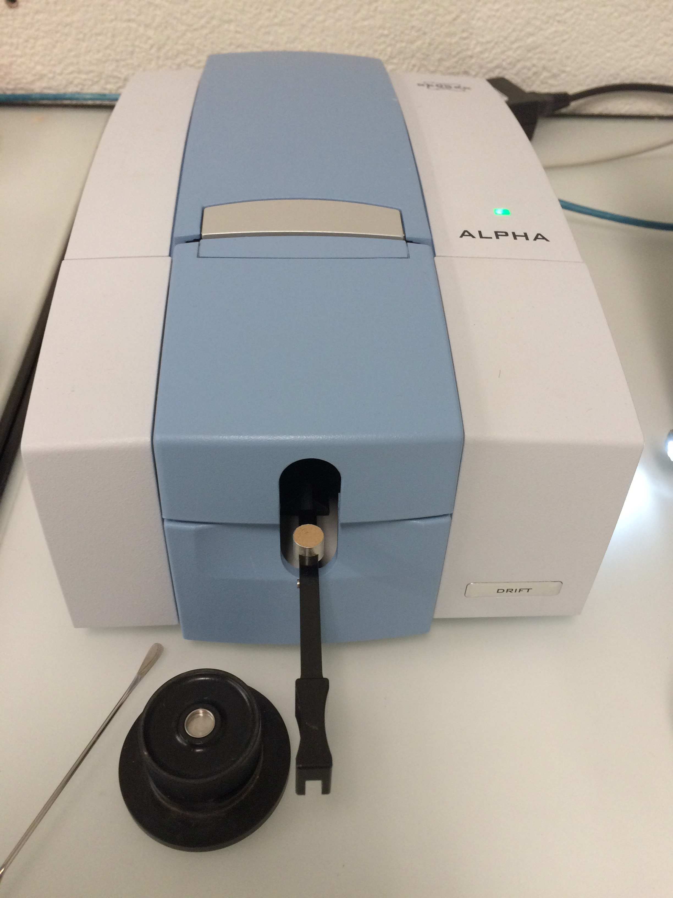

```{r setup, include=FALSE}
knitr::opts_chunk$set(echo = TRUE)
```

---

# Topics and goals of this section

* You will learn how to use different R base data structures and basic
  operations such as subsetting to explore and transform spectral data.
  
---
  
# Reading spectra from OPUS spectrometer files: prerequisites

Spectroscopy modeling requires that we first organize our spectra well. 
In particular, a proper and reproducible data management of spectral data,
metadata, and data from reference chemical analyses is key for all the 
subsequent data processing and modeling workflow.

The Sustainable Agroecosystems group at ETH relies on Diffuse Reflectance
Fourier Transform (DRIFT) infrared spectrometers manufactured by the company
*Bruker* (see Figure \ref{alpha_eth}). The manufacturer relies on a proprietary
binary format called *OPUS* to store an extensive amount of data that includes
different types of intermediary spectra. For each sample that was measured a 
single *OPUS* file is produced.

{width=200px}

## Reading spectrometer data into the R environment

```{r}
# Load collection of packages that work together seamlessly for efficient
# analysis workflows
library("tidyverse")
# Package that facilitates spectral data handling, processing and modeling
library("simplerspec")
```


