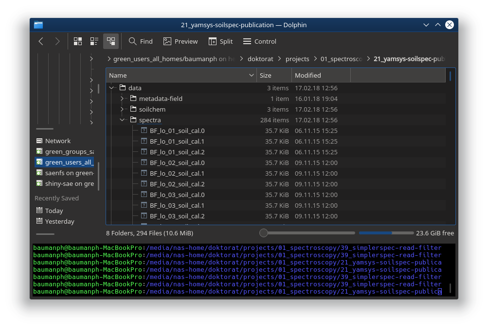

Read, filter and transform spectra and metadata
================
Philipp Baumann // <philipp.baumann@usys.ethz.ch>
July 25, 2018

-   [Getting started](#getting-started)
    -   [Prerequisites](#prerequisites)
    -   [Topics and goals of this section](#topics-and-goals-of-this-section)
    -   [How to interactively go throught the tutorial](#how-to-interactively-go-throught-the-tutorial)
-   [Reading spectra from OPUS spectrometer files: prerequisites](#reading-spectra-from-opus-spectrometer-files-prerequisites)
-   [Reading spectrometer data into the R environment](#reading-spectrometer-data-into-the-r-environment)
    -   [Spectral measurement data](#spectral-measurement-data)
    -   [Read the spectral data (OPUS files) as list into R](#read-the-spectral-data-opus-files-as-list-into-r)
    -   [Use R functions to gain an overview of the spectral data](#use-r-functions-to-gain-an-overview-of-the-spectral-data)
    -   [data.table data frames for storing spectral data](#data.table-data-frames-for-storing-spectral-data)
    -   [Advantages of lists](#advantages-of-lists)
-   [Session info](#session-info)

------------------------------------------------------------------------

For a html version of this tutorial, see [**here**](). You can also [download this tutorial as pdf]().

Getting started
===============

Prerequisites
-------------

-   First, you need to be familar how to work into R. [Here](https://github.com/philipp-baumann/simplerspec-teaching/blob/master/00_R-basics-spectro.md) I give some recommendations to start mastering spectroscopy analysis tasks.
-   You need to need to now that there are R basic data structures used for analysis. Have a first read [here](http://adv-r.had.co.nz/Data-structures.html) in the *Advanced R* book of Hadley Wickham.

Topics and goals of this section
--------------------------------

-   You will learn how to use different R base data structures and basic operations such as subsetting to explore and transform spectral data.

-   This hands-on tutorial teaches you the technical skills how to work with data structures in R by the example of manipulating spectral data.

How to interactively go throught the tutorial
---------------------------------------------

1.  Use the `Clone or Download` button and clone/download this tutorial repository from github to your computer.
2.  Unzip the folder
3.  Double-click the `.RProj` file and the tutorial is loaded as R project (no need to use `setwd()` and `yourverylonganduniquedirectoryonyourpc` or other nasty hard-coded approaches to set the working directory)
4.  For working with this R markdown notebooks for reproducible and interactive analysis, see [here](https://rmarkdown.rstudio.com/index.html)
5.  Have fun reproducing

------------------------------------------------------------------------

Reading spectra from OPUS spectrometer files: prerequisites
===========================================================

Spectroscopy modeling requires that we first organize our spectra well. In particular, a proper and reproducible data management of spectral data, metadata, and data from reference chemical analyses is key for all the subsequent data processing and modeling workflow.

The Sustainable Agroecosystems group at ETH relies on Diffuse Reflectance Fourier Transform (DRIFT) infrared spectrometers manufactured by the company *Bruker* (see Figure ). The manufacturer relies on a proprietary binary format called *OPUS* to store an extensive amount of data that includes different types of intermediary spectra. For each sample that was measured a single *OPUS* file is produced.


Reading spectrometer data into the R environment
================================================

First, we load the set of packages of `tidyverse` (see [**here**](http://tidyverse.org/) for details) and the `simplerspec` package (see [**here**](https://github.com/philipp-baumann/simplerspec/)). Simplerspec contains a universal file reader that allows to read selected parameters (e.g. instrument, optic and acquisition parameters) and all types of spectra from a single *OPUS* binary file or a list of files.

``` r
# Load collection of packages that work together seamlessly for efficient
# analysis workflows
library("tidyverse")
```

    ## ── Attaching packages ─────────────────────────────────────────────── tidyverse 1.2.1 ──

    ## ✔ ggplot2 3.0.0     ✔ purrr   0.2.5
    ## ✔ tibble  1.4.2     ✔ dplyr   0.7.6
    ## ✔ tidyr   0.8.1     ✔ stringr 1.3.1
    ## ✔ readr   1.1.1     ✔ forcats 0.3.0

    ## ── Conflicts ────────────────────────────────────────────────── tidyverse_conflicts() ──
    ## ✖ dplyr::filter() masks stats::filter()
    ## ✖ dplyr::lag()    masks stats::lag()

``` r
# Package that facilitates spectral data handling, processing and modeling
library("simplerspec")
```

    ## Loading required package: foreach

    ## 
    ## Attaching package: 'foreach'

    ## The following objects are masked from 'package:purrr':
    ## 
    ##     accumulate, when

I recommended that you set up a self-contained directory where all R scripts, data (spectra and chemical reference data), models, outputs (figures and text files of data and model summaries), and predictions live. Further, you can use the folder structure depicted in figure to organize your spectroscopy-related research projects.


When you have spectra that cover separate experiments and/or different locations and times, you might prefer to organize your spectra as sub-folders within `data/spectra`. This hands-on is based on spectral data that were used to build and evaluate the YAMSYS spectroscopy reference models. Besides these reference spectra measured with a Bruker ALPHA mid-IR spectrometer at the Sustainable Agroecosystems group at ETH Zürich, there are other spectra that have been acquired to test different questions such as spectrometer cross-comparisons. Therefore, other comparison spectra are in separate paths, e.g. `data/spectra/soilspec_eth_bin`.

In the Figure below you can see a file explorer screenshot showing *OPUS* files of three replicate scans for each of the first three reference soil samples. *OPUS* have the extension `.n` where `n` represents an integer of repeated sample measurements starting from 0.



We aim to read all the reference spectra contained within this folder. First, we get the full path names of the file names, which we subsequently assign to the object `files`:

``` r
# Extract data from OPUS binary files; list of file paths
files <- list.files("data/spectra", full.names = TRUE)
```

Note that you need to set the `full.names` argument to `TRUE` (default is `FALSE` to get the path of all *OPUS* spectra files contained within the target directory, otherwise R will not be able to find the files when using the universal `simplerspec` *OPUS* reader.

You can compactly display the internal structure of the `files` object:

``` r
str(files)
```

    ##  chr [1:284] "data/spectra/BF_lo_01_soil_cal.0" ...

The object `files` has the data structure *atomic vector*. *Atomic vectors* have six possible basic (*atomic*) vector types. These are *logical*, *integer*, *real*, *complex*, *string* (or *character*) and *raw*. Vector types can be returned by the R base function `typeof(x)`, which returns the type or internal storage mode an object `x`. For the `files` object it is

``` r
# Check type of files object
typeof(files)
```

    ## [1] "character"

We get the length of the vector or the number of elements by

``` r
# How many files are listed to read? length of vector
length(files)
```

    ## [1] 284

Base R has subsetting operations that allow you to extract pieces of data structures you are interested in. One of the three base subsetting operators is `[`.

We subset the character vector `files` as follows:

``` r
# Use character subsetting to return the first element
# Subsetting can be seen as complement to str()
# (1) Subsetting with positive integers (position)
files[1:3]
```

    ## [1] "data/spectra/BF_lo_01_soil_cal.0" "data/spectra/BF_lo_01_soil_cal.1"
    ## [3] "data/spectra/BF_lo_01_soil_cal.2"

``` r
# (2) Subsetting with negative integers (remove values)
head(files[-c(1:3)], n = 5L) # show only first 5 values
```

    ## [1] "data/spectra/BF_lo_02_soil_cal.0" "data/spectra/BF_lo_02_soil_cal.1"
    ## [3] "data/spectra/BF_lo_02_soil_cal.2" "data/spectra/BF_lo_03_soil_cal.0"
    ## [5] "data/spectra/BF_lo_03_soil_cal.1"

``` r
# The first three elements of the character vector are removed
```

Spectral measurement data
-------------------------

Bruker FTIR spectrometers produce binary files in the OPUS format that can contain different types of spectra and many parameters such as instrument type and settings that were used at the time of data acquisition and internal processing (e.g. Fourier transform operations). Basically, the entire set of *Setup Measurement Parameters*, selected spectra, supplementary metadata such as the time of measurement are written into *OPUS* binary files. In contrast to simple text files that contain only plain text with a defined character encoding, binary files can contain any type of data represented as sequences of bytes (a single byte is sequence of 8 bits and 1 bit either represents 0 or 1).

Figure shows graphical representation from the *OPUS* viewer software to get familiarize with types of parameters *OPUS* files may contain.


You can download the *OPUS viewer* software from [**this Bruker webpage**](https://www.bruker.com/products/infrared-near-infrared-and-raman-spectroscopy/opus-spectroscopy-software/downloads/opus-downloads.html) for free. However, Bruker only provides a Windows version and the free version is limited to visualize only final spectra. The remaining spectral blocks can be checked choosing the menu *Window* &gt; *New Report Window* and opening *OPUS* by the menu *File* &gt; *Load File*.

The types of spectra and associated data parameters that are saved after a single measurement depend on the options that are selected in the *OPUS* software. For data acquisition, the values under the tab *Advanced* of the *Setup Measurement Parameters* menu window in the *OPUS* software.

Depending on the standard of a binary file, different regions in a file can be interpreted differently by a program. For example, some information at some block positions need to be interpreted as a certain type of number representation whereas others are text. Hence, the interpretation of different bit positions in the file requires either a priori knowledge provided by some file specifications or extensive reverse-engineering.

Instead of sharing the full binary file specification, Bruker ships the *OPUS* macro programming language or Microsoft Visual Basic scripts for automated data acquisition and processing. However, this approaches are very inflexible and not transparent, and therefore not reproducible. Hence, the idea of implementing a file reader that is integrated in the R statistical programming environment was targeted first in the `soil.spec` R package created by Andrew Sila (ICRAF, Nairobi), Tomislav Hengl (ISRIC -- World Soil Information) and Thomas Terhoeven-Urselmans (former member of ICRAF, Nairobi). `soil.spec` was created based on the African Soil Information Services (AfSIS) project (see [here for more information](http://africasoils.net/)). Because this reader worked only when applying a restricted set of settings and procedures in OPUS, the idea came up to modify and extend the previously mentioned `soil.spec::read.opus()` function. This restriction is mainly due to the fact that positions where spectra occur are not fixed and there is no evident accessible information about the sequence of spectra and data parameters and the type of present spectra. Therefore, I have been working extensively on a universal Bruker OPUS format file reader that can correctly assign and read out different spectra types from any type of Bruker FTIR spectrometer with different blocks saved and with and without atmospheric compensation.

Simplerspec comes with reader function written in R, that is intended to be a universal Bruker OPUS file reader that extract spectra and key metadata from files. Usually, one is mostly interested to extract the final absorbance spectra (shown as `AB` in the *OPUS viewer* software).

Read the spectral data (OPUS files) as list into R
--------------------------------------------------

``` r
## Register parallel backend for using multiple cores

# Allows to tune the models using parallel processing (e.g. use all available
# cores of a CPU); caret package automatically detects the registered backend
library("doParallel")
# Make a cluster with all possible threads (more than physical cores)
cl <- makeCluster(detectCores())
# Register backend
registerDoParallel(cl)
# Return number of parallel workers
getDoParWorkers() # 8 threads on MacBook Pro (Retina, 15-inch, Mid 2015);
```

    ## [1] 8

``` r
# Quadcore processor

# Read spectra and metadata of all binary OPUS files into a list
spc_list <- read_opus_univ(fnames = files, extract = c("spc"), parallel = TRUE)
```

Use R functions to gain an overview of the spectral data
--------------------------------------------------------

The extracted spectra and metadata data are within a list. A list is a very flexible R data structure that can contain any other type of R objects. You can think of lists as containers that help to save and transform objects. Lists can contain hierarchically nested elements, e.g. a list can contain lists. In this case, the list contains the following elements:

``` r
# Return the names of a list; names() returns a character vector
# of the elemelement names and `[` extracts the first 10 names
names(spc_list)[1:10]
```

    ##  [1] "BF_lo_01_soil_cal.0" "BF_lo_01_soil_cal.1" "BF_lo_01_soil_cal.2"
    ##  [4] "BF_lo_02_soil_cal.0" "BF_lo_02_soil_cal.1" "BF_lo_02_soil_cal.2"
    ##  [7] "BF_lo_03_soil_cal.0" "BF_lo_03_soil_cal.1" "BF_lo_03_soil_cal.2"
    ## [10] "BF_lo_04_soil_cal.0"

``` r
# The names from the spectral data list are identical to the
# files that were read (file names without path of folder where data
# are contained)
files[1:10]
```

    ##  [1] "data/spectra/BF_lo_01_soil_cal.0" "data/spectra/BF_lo_01_soil_cal.1"
    ##  [3] "data/spectra/BF_lo_01_soil_cal.2" "data/spectra/BF_lo_02_soil_cal.0"
    ##  [5] "data/spectra/BF_lo_02_soil_cal.1" "data/spectra/BF_lo_02_soil_cal.2"
    ##  [7] "data/spectra/BF_lo_03_soil_cal.0" "data/spectra/BF_lo_03_soil_cal.1"
    ##  [9] "data/spectra/BF_lo_03_soil_cal.2" "data/spectra/BF_lo_04_soil_cal.0"

**List subsetting/extraction of components:** Lists can be subsetted similar to atomic vectors by the `[` and `[[` operators. The most important difference is that `[` returns a list (sub-list of list) and `[[` returns the content of a single component of the list (note that a single components can still contain sub-lists). Based on the `[` operator we can extract spectra and metadata from a single replicate measurement of a sample:

``` r
# Display structure
str(spc_list["BF_lo_01_soil_cal.0"])
```

    ## List of 1
    ##  $ BF_lo_01_soil_cal.0:List of 10
    ##   ..$ metadata         :Classes 'tbl_df', 'tbl' and 'data.frame':    1 obs. of  20 variables:
    ##   .. ..$ unique_id       : chr "BF_lo_01_soil_cal.0_2015-11-06 14:34:10"
    ##   .. ..$ file_id         : chr "BF_lo_01_soil_cal.0"
    ##   .. ..$ sample_id       : chr "BF_lo_01_soil_cal"
    ##   .. ..$ rep_no          : num 0
    ##   .. ..$ date_time_sm    : POSIXct[1:1], format: "2015-11-06 14:34:10"
    ##   .. ..$ date_time_rf    : POSIXct[1:1], format: "2015-11-06 14:30:10"
    ##   .. ..$ sample_name     : chr "BF_lo_01_soil_cal"
    ##   .. ..$ instr_name_range: chr "alpha-mir"
    ##   .. ..$ resolution_wn   : int 4
    ##   .. ..$ result_spc      : chr "AB"
    ##   .. ..$ beamspl         : chr "ZnS"
    ##   .. ..$ laser_wn        : num 11602
    ##   .. ..$ spc_in_file     : chr "ScSm;ScRf;spc_nocomp;spc"
    ##   .. ..$ zero_filling    : int 2
    ##   .. ..$ temp_scanner_sm : num 33.7
    ##   .. ..$ temp_scanner_rf : num 33.6
    ##   .. ..$ hum_rel_sm      : int 25
    ##   .. ..$ hum_rel_rf      : int 25
    ##   .. ..$ hum_abs_sm      : num 9.5
    ##   .. ..$ hum_abs_rf      : num 9.49
    ##   ..$ spc              :Classes 'data.table' and 'data.frame':   1 obs. of  1716 variables:
    ##   .. ..$ 3997.4: num 0.112
    ##   .. ..$ 3995.4: num 0.111
    ##   .. ..$ 3993.3: num 0.11
    ##   .. ..$ 3991.3: num 0.111
    ##   .. ..$ 3989.2: num 0.111
    ##   .. ..$ 3987.2: num 0.112
    ##   .. ..$ 3985.2: num 0.112
    ##   .. ..$ 3983.1: num 0.112
    ##   .. ..$ 3981.1: num 0.111
    ##   .. ..$ 3979  : num 0.111
    ##   .. ..$ 3977  : num 0.111
    ##   .. ..$ 3975  : num 0.11
    ##   .. ..$ 3972.9: num 0.109
    ##   .. ..$ 3970.9: num 0.109
    ##   .. ..$ 3968.8: num 0.11
    ##   .. ..$ 3966.8: num 0.111
    ##   .. ..$ 3964.8: num 0.111
    ##   .. ..$ 3962.7: num 0.111
    ##   .. ..$ 3960.7: num 0.111
    ##   .. ..$ 3958.6: num 0.11
    ##   .. ..$ 3956.6: num 0.11
    ##   .. ..$ 3954.6: num 0.109
    ##   .. ..$ 3952.5: num 0.108
    ##   .. ..$ 3950.5: num 0.107
    ##   .. ..$ 3948.4: num 0.107
    ##   .. ..$ 3946.4: num 0.106
    ##   .. ..$ 3944.4: num 0.106
    ##   .. ..$ 3942.3: num 0.108
    ##   .. ..$ 3940.3: num 0.108
    ##   .. ..$ 3938.3: num 0.11
    ##   .. ..$ 3936.2: num 0.11
    ##   .. ..$ 3934.2: num 0.109
    ##   .. ..$ 3932.1: num 0.107
    ##   .. ..$ 3930.1: num 0.103
    ##   .. ..$ 3928.1: num 0.102
    ##   .. ..$ 3926  : num 0.104
    ##   .. ..$ 3924  : num 0.104
    ##   .. ..$ 3921.9: num 0.104
    ##   .. ..$ 3919.9: num 0.106
    ##   .. ..$ 3917.9: num 0.108
    ##   .. ..$ 3915.8: num 0.109
    ##   .. ..$ 3913.8: num 0.11
    ##   .. ..$ 3911.7: num 0.113
    ##   .. ..$ 3909.7: num 0.112
    ##   .. ..$ 3907.7: num 0.107
    ##   .. ..$ 3905.6: num 0.102
    ##   .. ..$ 3903.6: num 0.0946
    ##   .. ..$ 3901.5: num 0.0903
    ##   .. ..$ 3899.5: num 0.093
    ##   .. ..$ 3897.5: num 0.0965
    ##   .. ..$ 3895.4: num 0.1
    ##   .. ..$ 3893.4: num 0.107
    ##   .. ..$ 3891.3: num 0.108
    ##   .. ..$ 3889.3: num 0.104
    ##   .. ..$ 3887.3: num 0.105
    ##   .. ..$ 3885.2: num 0.105
    ##   .. ..$ 3883.2: num 0.101
    ##   .. ..$ 3881.1: num 0.103
    ##   .. ..$ 3879.1: num 0.104
    ##   .. ..$ 3877.1: num 0.103
    ##   .. ..$ 3875  : num 0.103
    ##   .. ..$ 3873  : num 0.0997
    ##   .. ..$ 3870.9: num 0.0971
    ##   .. ..$ 3868.9: num 0.0937
    ##   .. ..$ 3866.9: num 0.0923
    ##   .. ..$ 3864.8: num 0.0978
    ##   .. ..$ 3862.8: num 0.102
    ##   .. ..$ 3860.8: num 0.101
    ##   .. ..$ 3858.7: num 0.1
    ##   .. ..$ 3856.7: num 0.103
    ##   .. ..$ 3854.6: num 0.107
    ##   .. ..$ 3852.6: num 0.0999
    ##   .. ..$ 3850.6: num 0.0927
    ##   .. ..$ 3848.5: num 0.0989
    ##   .. ..$ 3846.5: num 0.109
    ##   .. ..$ 3844.4: num 0.11
    ##   .. ..$ 3842.4: num 0.101
    ##   .. ..$ 3840.4: num 0.0939
    ##   .. ..$ 3838.3: num 0.093
    ##   .. ..$ 3836.3: num 0.0941
    ##   .. ..$ 3834.2: num 0.0988
    ##   .. ..$ 3832.2: num 0.106
    ##   .. ..$ 3830.2: num 0.11
    ##   .. ..$ 3828.1: num 0.11
    ##   .. ..$ 3826.1: num 0.108
    ##   .. ..$ 3824  : num 0.105
    ##   .. ..$ 3822  : num 0.103
    ##   .. ..$ 3820  : num 0.0964
    ##   .. ..$ 3817.9: num 0.0978
    ##   .. ..$ 3815.9: num 0.11
    ##   .. ..$ 3813.8: num 0.116
    ##   .. ..$ 3811.8: num 0.118
    ##   .. ..$ 3809.8: num 0.122
    ##   .. ..$ 3807.7: num 0.122
    ##   .. ..$ 3805.7: num 0.111
    ##   .. ..$ 3803.6: num 0.105
    ##   .. ..$ 3801.6: num 0.107
    ##   .. ..$ 3799.6: num 0.105
    ##   .. ..$ 3797.5: num 0.11
    ##   .. .. [list output truncated]
    ##   .. ..- attr(*, ".internal.selfref")=<externalptr> 
    ##   ..$ spc_nocomp       : NULL
    ##   ..$ sc_sm            : NULL
    ##   ..$ sc_rf            : NULL
    ##   ..$ ig_sm            : NULL
    ##   ..$ ig_rf            : NULL
    ##   ..$ wavenumbers      : num [1:1716] 3997 3995 3993 3991 3989 ...
    ##   ..$ wavenumbers_sc_sm: NULL
    ##   ..$ wavenumbers_sc_rf: NULL

The above code extracts a list with one element that is named `BF_lo_01_soil_cal.0`, whereas using `[[` shows the content of the subsetted list and the name is not shown anymore. The content contains again 9 elements, as `str()` reveals:

``` r
str(spc_list[["BF_lo_01_soil_cal.0"]])
```

    ## List of 10
    ##  $ metadata         :Classes 'tbl_df', 'tbl' and 'data.frame':   1 obs. of  20 variables:
    ##   ..$ unique_id       : chr "BF_lo_01_soil_cal.0_2015-11-06 14:34:10"
    ##   ..$ file_id         : chr "BF_lo_01_soil_cal.0"
    ##   ..$ sample_id       : chr "BF_lo_01_soil_cal"
    ##   ..$ rep_no          : num 0
    ##   ..$ date_time_sm    : POSIXct[1:1], format: "2015-11-06 14:34:10"
    ##   ..$ date_time_rf    : POSIXct[1:1], format: "2015-11-06 14:30:10"
    ##   ..$ sample_name     : chr "BF_lo_01_soil_cal"
    ##   ..$ instr_name_range: chr "alpha-mir"
    ##   ..$ resolution_wn   : int 4
    ##   ..$ result_spc      : chr "AB"
    ##   ..$ beamspl         : chr "ZnS"
    ##   ..$ laser_wn        : num 11602
    ##   ..$ spc_in_file     : chr "ScSm;ScRf;spc_nocomp;spc"
    ##   ..$ zero_filling    : int 2
    ##   ..$ temp_scanner_sm : num 33.7
    ##   ..$ temp_scanner_rf : num 33.6
    ##   ..$ hum_rel_sm      : int 25
    ##   ..$ hum_rel_rf      : int 25
    ##   ..$ hum_abs_sm      : num 9.5
    ##   ..$ hum_abs_rf      : num 9.49
    ##  $ spc              :Classes 'data.table' and 'data.frame':  1 obs. of  1716 variables:
    ##   ..$ 3997.4: num 0.112
    ##   ..$ 3995.4: num 0.111
    ##   ..$ 3993.3: num 0.11
    ##   ..$ 3991.3: num 0.111
    ##   ..$ 3989.2: num 0.111
    ##   ..$ 3987.2: num 0.112
    ##   ..$ 3985.2: num 0.112
    ##   ..$ 3983.1: num 0.112
    ##   ..$ 3981.1: num 0.111
    ##   ..$ 3979  : num 0.111
    ##   ..$ 3977  : num 0.111
    ##   ..$ 3975  : num 0.11
    ##   ..$ 3972.9: num 0.109
    ##   ..$ 3970.9: num 0.109
    ##   ..$ 3968.8: num 0.11
    ##   ..$ 3966.8: num 0.111
    ##   ..$ 3964.8: num 0.111
    ##   ..$ 3962.7: num 0.111
    ##   ..$ 3960.7: num 0.111
    ##   ..$ 3958.6: num 0.11
    ##   ..$ 3956.6: num 0.11
    ##   ..$ 3954.6: num 0.109
    ##   ..$ 3952.5: num 0.108
    ##   ..$ 3950.5: num 0.107
    ##   ..$ 3948.4: num 0.107
    ##   ..$ 3946.4: num 0.106
    ##   ..$ 3944.4: num 0.106
    ##   ..$ 3942.3: num 0.108
    ##   ..$ 3940.3: num 0.108
    ##   ..$ 3938.3: num 0.11
    ##   ..$ 3936.2: num 0.11
    ##   ..$ 3934.2: num 0.109
    ##   ..$ 3932.1: num 0.107
    ##   ..$ 3930.1: num 0.103
    ##   ..$ 3928.1: num 0.102
    ##   ..$ 3926  : num 0.104
    ##   ..$ 3924  : num 0.104
    ##   ..$ 3921.9: num 0.104
    ##   ..$ 3919.9: num 0.106
    ##   ..$ 3917.9: num 0.108
    ##   ..$ 3915.8: num 0.109
    ##   ..$ 3913.8: num 0.11
    ##   ..$ 3911.7: num 0.113
    ##   ..$ 3909.7: num 0.112
    ##   ..$ 3907.7: num 0.107
    ##   ..$ 3905.6: num 0.102
    ##   ..$ 3903.6: num 0.0946
    ##   ..$ 3901.5: num 0.0903
    ##   ..$ 3899.5: num 0.093
    ##   ..$ 3897.5: num 0.0965
    ##   ..$ 3895.4: num 0.1
    ##   ..$ 3893.4: num 0.107
    ##   ..$ 3891.3: num 0.108
    ##   ..$ 3889.3: num 0.104
    ##   ..$ 3887.3: num 0.105
    ##   ..$ 3885.2: num 0.105
    ##   ..$ 3883.2: num 0.101
    ##   ..$ 3881.1: num 0.103
    ##   ..$ 3879.1: num 0.104
    ##   ..$ 3877.1: num 0.103
    ##   ..$ 3875  : num 0.103
    ##   ..$ 3873  : num 0.0997
    ##   ..$ 3870.9: num 0.0971
    ##   ..$ 3868.9: num 0.0937
    ##   ..$ 3866.9: num 0.0923
    ##   ..$ 3864.8: num 0.0978
    ##   ..$ 3862.8: num 0.102
    ##   ..$ 3860.8: num 0.101
    ##   ..$ 3858.7: num 0.1
    ##   ..$ 3856.7: num 0.103
    ##   ..$ 3854.6: num 0.107
    ##   ..$ 3852.6: num 0.0999
    ##   ..$ 3850.6: num 0.0927
    ##   ..$ 3848.5: num 0.0989
    ##   ..$ 3846.5: num 0.109
    ##   ..$ 3844.4: num 0.11
    ##   ..$ 3842.4: num 0.101
    ##   ..$ 3840.4: num 0.0939
    ##   ..$ 3838.3: num 0.093
    ##   ..$ 3836.3: num 0.0941
    ##   ..$ 3834.2: num 0.0988
    ##   ..$ 3832.2: num 0.106
    ##   ..$ 3830.2: num 0.11
    ##   ..$ 3828.1: num 0.11
    ##   ..$ 3826.1: num 0.108
    ##   ..$ 3824  : num 0.105
    ##   ..$ 3822  : num 0.103
    ##   ..$ 3820  : num 0.0964
    ##   ..$ 3817.9: num 0.0978
    ##   ..$ 3815.9: num 0.11
    ##   ..$ 3813.8: num 0.116
    ##   ..$ 3811.8: num 0.118
    ##   ..$ 3809.8: num 0.122
    ##   ..$ 3807.7: num 0.122
    ##   ..$ 3805.7: num 0.111
    ##   ..$ 3803.6: num 0.105
    ##   ..$ 3801.6: num 0.107
    ##   ..$ 3799.6: num 0.105
    ##   ..$ 3797.5: num 0.11
    ##   .. [list output truncated]
    ##   ..- attr(*, ".internal.selfref")=<externalptr> 
    ##  $ spc_nocomp       : NULL
    ##  $ sc_sm            : NULL
    ##  $ sc_rf            : NULL
    ##  $ ig_sm            : NULL
    ##  $ ig_rf            : NULL
    ##  $ wavenumbers      : num [1:1716] 3997 3995 3993 3991 3989 ...
    ##  $ wavenumbers_sc_sm: NULL
    ##  $ wavenumbers_sc_rf: NULL

``` r
head(spc_list[["BF_lo_01_soil_cal.0"]][["wavenumbers"]])
```

    ## [1] 3997.397 3995.357 3993.318 3991.278 3989.239 3987.199

Using the function `ls()` returns a vector of character strings giving the names of the list:

``` r
# Show names of first hierarchy of list
ls(spc_list[["BF_lo_01_soil_cal.0"]])
```

    ##  [1] "ig_rf"             "ig_sm"             "metadata"         
    ##  [4] "sc_rf"             "sc_sm"             "spc"              
    ##  [7] "spc_nocomp"        "wavenumbers"       "wavenumbers_sc_rf"
    ## [10] "wavenumbers_sc_sm"

To extract nested elements from a list, you can repeatedly apply subsetting operators. Besides using name subsetting for named data structures that contain a name attribute you can also use integers as index or logical vectors (TRUE and FALSE).

``` r
names(spc_list["BF_lo_01_soil_cal.0"]) # subset by name of first element
```

    ## [1] "BF_lo_01_soil_cal.0"

``` r
# subset by integer index, result is identical
names(spc_list[1]) == names(spc_list["BF_lo_01_soil_cal.0"])
```

    ## [1] TRUE

For logical subsetting we create a new vector containing TRUE or FALSE that is of same length as the spectra list `spc_list`. Usually logical type vectors are returned when testing conditions using binary operators that allow the comparison of values in atomic vectors (see R help for *relational operators* by entering `?Comparision` in the R console; e.g. `<`, `>`, `==`). Here, we create a logical vector `logical_subset` manually in order to illustrate that subsetting also works with vectors of type logical:

``` r
# repeat FALSE length(spc_list) times
logical_subset <- rep(FALSE, length(spc_list))


# Print subsetting vector
logical_subset
```

    ##   [1] FALSE FALSE FALSE FALSE FALSE FALSE FALSE FALSE FALSE FALSE FALSE
    ##  [12] FALSE FALSE FALSE FALSE FALSE FALSE FALSE FALSE FALSE FALSE FALSE
    ##  [23] FALSE FALSE FALSE FALSE FALSE FALSE FALSE FALSE FALSE FALSE FALSE
    ##  [34] FALSE FALSE FALSE FALSE FALSE FALSE FALSE FALSE FALSE FALSE FALSE
    ##  [45] FALSE FALSE FALSE FALSE FALSE FALSE FALSE FALSE FALSE FALSE FALSE
    ##  [56] FALSE FALSE FALSE FALSE FALSE FALSE FALSE FALSE FALSE FALSE FALSE
    ##  [67] FALSE FALSE FALSE FALSE FALSE FALSE FALSE FALSE FALSE FALSE FALSE
    ##  [78] FALSE FALSE FALSE FALSE FALSE FALSE FALSE FALSE FALSE FALSE FALSE
    ##  [89] FALSE FALSE FALSE FALSE FALSE FALSE FALSE FALSE FALSE FALSE FALSE
    ## [100] FALSE FALSE FALSE FALSE FALSE FALSE FALSE FALSE FALSE FALSE FALSE
    ## [111] FALSE FALSE FALSE FALSE FALSE FALSE FALSE FALSE FALSE FALSE FALSE
    ## [122] FALSE FALSE FALSE FALSE FALSE FALSE FALSE FALSE FALSE FALSE FALSE
    ## [133] FALSE FALSE FALSE FALSE FALSE FALSE FALSE FALSE FALSE FALSE FALSE
    ## [144] FALSE FALSE FALSE FALSE FALSE FALSE FALSE FALSE FALSE FALSE FALSE
    ## [155] FALSE FALSE FALSE FALSE FALSE FALSE FALSE FALSE FALSE FALSE FALSE
    ## [166] FALSE FALSE FALSE FALSE FALSE FALSE FALSE FALSE FALSE FALSE FALSE
    ## [177] FALSE FALSE FALSE FALSE FALSE FALSE FALSE FALSE FALSE FALSE FALSE
    ## [188] FALSE FALSE FALSE FALSE FALSE FALSE FALSE FALSE FALSE FALSE FALSE
    ## [199] FALSE FALSE FALSE FALSE FALSE FALSE FALSE FALSE FALSE FALSE FALSE
    ## [210] FALSE FALSE FALSE FALSE FALSE FALSE FALSE FALSE FALSE FALSE FALSE
    ## [221] FALSE FALSE FALSE FALSE FALSE FALSE FALSE FALSE FALSE FALSE FALSE
    ## [232] FALSE FALSE FALSE FALSE FALSE FALSE FALSE FALSE FALSE FALSE FALSE
    ## [243] FALSE FALSE FALSE FALSE FALSE FALSE FALSE FALSE FALSE FALSE FALSE
    ## [254] FALSE FALSE FALSE FALSE FALSE FALSE FALSE FALSE FALSE FALSE FALSE
    ## [265] FALSE FALSE FALSE FALSE FALSE FALSE FALSE FALSE FALSE FALSE FALSE
    ## [276] FALSE FALSE FALSE FALSE FALSE FALSE FALSE FALSE FALSE

``` r
# Check type
typeof(logical_subset)
```

    ## [1] "logical"

Subsetting and assignment can be combined to replace the third element with `FALSE`:

``` r
# Replace the 3rd element with TRUE; use subsetting and assignment
logical_subset[3] <- TRUE
```

Subsequently, we can use the newly created logical vector for subsetting the spectral data list

``` r
# Extract list with `[`; use str() to show a compact output that
# is nicely printed
str(spc_list[logical_subset]) # Returns positions that are TRUE, element 3
```

    ## List of 1
    ##  $ BF_lo_01_soil_cal.2:List of 10
    ##   ..$ metadata         :Classes 'tbl_df', 'tbl' and 'data.frame':    1 obs. of  20 variables:
    ##   .. ..$ unique_id       : chr "BF_lo_01_soil_cal.2_2015-11-06 14:40:55"
    ##   .. ..$ file_id         : chr "BF_lo_01_soil_cal.2"
    ##   .. ..$ sample_id       : chr "BF_lo_01_soil_cal"
    ##   .. ..$ rep_no          : num 2
    ##   .. ..$ date_time_sm    : POSIXct[1:1], format: "2015-11-06 14:40:55"
    ##   .. ..$ date_time_rf    : POSIXct[1:1], format: "2015-11-06 14:30:10"
    ##   .. ..$ sample_name     : chr "BF_lo_01_soil_cal"
    ##   .. ..$ instr_name_range: chr "alpha-mir"
    ##   .. ..$ resolution_wn   : int 4
    ##   .. ..$ result_spc      : chr "AB"
    ##   .. ..$ beamspl         : chr "ZnS"
    ##   .. ..$ laser_wn        : num 11602
    ##   .. ..$ spc_in_file     : chr "ScSm;ScRf;spc_nocomp;spc"
    ##   .. ..$ zero_filling    : int 2
    ##   .. ..$ temp_scanner_sm : num 33.7
    ##   .. ..$ temp_scanner_rf : num 33.6
    ##   .. ..$ hum_rel_sm      : int 25
    ##   .. ..$ hum_rel_rf      : int 25
    ##   .. ..$ hum_abs_sm      : num 9.51
    ##   .. ..$ hum_abs_rf      : num 9.49
    ##   ..$ spc              :Classes 'data.table' and 'data.frame':   1 obs. of  1716 variables:
    ##   .. ..$ 3997.4: num 0.136
    ##   .. ..$ 3995.4: num 0.135
    ##   .. ..$ 3993.3: num 0.135
    ##   .. ..$ 3991.3: num 0.135
    ##   .. ..$ 3989.2: num 0.135
    ##   .. ..$ 3987.2: num 0.136
    ##   .. ..$ 3985.2: num 0.136
    ##   .. ..$ 3983.1: num 0.136
    ##   .. ..$ 3981.1: num 0.136
    ##   .. ..$ 3979  : num 0.135
    ##   .. ..$ 3977  : num 0.135
    ##   .. ..$ 3975  : num 0.134
    ##   .. ..$ 3972.9: num 0.133
    ##   .. ..$ 3970.9: num 0.134
    ##   .. ..$ 3968.8: num 0.135
    ##   .. ..$ 3966.8: num 0.135
    ##   .. ..$ 3964.8: num 0.135
    ##   .. ..$ 3962.7: num 0.136
    ##   .. ..$ 3960.7: num 0.135
    ##   .. ..$ 3958.6: num 0.134
    ##   .. ..$ 3956.6: num 0.133
    ##   .. ..$ 3954.6: num 0.133
    ##   .. ..$ 3952.5: num 0.131
    ##   .. ..$ 3950.5: num 0.132
    ##   .. ..$ 3948.4: num 0.131
    ##   .. ..$ 3946.4: num 0.13
    ##   .. ..$ 3944.4: num 0.131
    ##   .. ..$ 3942.3: num 0.132
    ##   .. ..$ 3940.3: num 0.132
    ##   .. ..$ 3938.3: num 0.133
    ##   .. ..$ 3936.2: num 0.134
    ##   .. ..$ 3934.2: num 0.134
    ##   .. ..$ 3932.1: num 0.132
    ##   .. ..$ 3930.1: num 0.128
    ##   .. ..$ 3928.1: num 0.126
    ##   .. ..$ 3926  : num 0.129
    ##   .. ..$ 3924  : num 0.129
    ##   .. ..$ 3921.9: num 0.127
    ##   .. ..$ 3919.9: num 0.13
    ##   .. ..$ 3917.9: num 0.133
    ##   .. ..$ 3915.8: num 0.134
    ##   .. ..$ 3913.8: num 0.135
    ##   .. ..$ 3911.7: num 0.137
    ##   .. ..$ 3909.7: num 0.135
    ##   .. ..$ 3907.7: num 0.131
    ##   .. ..$ 3905.6: num 0.126
    ##   .. ..$ 3903.6: num 0.12
    ##   .. ..$ 3901.5: num 0.116
    ##   .. ..$ 3899.5: num 0.118
    ##   .. ..$ 3897.5: num 0.119
    ##   .. ..$ 3895.4: num 0.122
    ##   .. ..$ 3893.4: num 0.131
    ##   .. ..$ 3891.3: num 0.133
    ##   .. ..$ 3889.3: num 0.128
    ##   .. ..$ 3887.3: num 0.13
    ##   .. ..$ 3885.2: num 0.13
    ##   .. ..$ 3883.2: num 0.125
    ##   .. ..$ 3881.1: num 0.128
    ##   .. ..$ 3879.1: num 0.128
    ##   .. ..$ 3877.1: num 0.126
    ##   .. ..$ 3875  : num 0.127
    ##   .. ..$ 3873  : num 0.126
    ##   .. ..$ 3870.9: num 0.124
    ##   .. ..$ 3868.9: num 0.119
    ##   .. ..$ 3866.9: num 0.116
    ##   .. ..$ 3864.8: num 0.122
    ##   .. ..$ 3862.8: num 0.126
    ##   .. ..$ 3860.8: num 0.124
    ##   .. ..$ 3858.7: num 0.122
    ##   .. ..$ 3856.7: num 0.128
    ##   .. ..$ 3854.6: num 0.138
    ##   .. ..$ 3852.6: num 0.131
    ##   .. ..$ 3850.6: num 0.117
    ##   .. ..$ 3848.5: num 0.12
    ##   .. ..$ 3846.5: num 0.131
    ##   .. ..$ 3844.4: num 0.133
    ##   .. ..$ 3842.4: num 0.126
    ##   .. ..$ 3840.4: num 0.119
    ##   .. ..$ 3838.3: num 0.119
    ##   .. ..$ 3836.3: num 0.119
    ##   .. ..$ 3834.2: num 0.122
    ##   .. ..$ 3832.2: num 0.13
    ##   .. ..$ 3830.2: num 0.134
    ##   .. ..$ 3828.1: num 0.135
    ##   .. ..$ 3826.1: num 0.131
    ##   .. ..$ 3824  : num 0.128
    ##   .. ..$ 3822  : num 0.129
    ##   .. ..$ 3820  : num 0.121
    ##   .. ..$ 3817.9: num 0.122
    ##   .. ..$ 3815.9: num 0.135
    ##   .. ..$ 3813.8: num 0.139
    ##   .. ..$ 3811.8: num 0.139
    ##   .. ..$ 3809.8: num 0.145
    ##   .. ..$ 3807.7: num 0.147
    ##   .. ..$ 3805.7: num 0.135
    ##   .. ..$ 3803.6: num 0.128
    ##   .. ..$ 3801.6: num 0.132
    ##   .. ..$ 3799.6: num 0.13
    ##   .. ..$ 3797.5: num 0.134
    ##   .. .. [list output truncated]
    ##   .. ..- attr(*, ".internal.selfref")=<externalptr> 
    ##   ..$ spc_nocomp       : NULL
    ##   ..$ sc_sm            : NULL
    ##   ..$ sc_rf            : NULL
    ##   ..$ ig_sm            : NULL
    ##   ..$ ig_rf            : NULL
    ##   ..$ wavenumbers      : num [1:1716] 3997 3995 3993 3991 3989 ...
    ##   ..$ wavenumbers_sc_sm: NULL
    ##   ..$ wavenumbers_sc_rf: NULL

We can also test if the spectral list contains certain characters in the file name by using pattern matching functions. If one has used the string `"_tb_"` as part of the sample identifier to specify the sampling region in the file names, we might be interested in selecting only spectra and metadata of these region (`"_tb_"` stands for the site Tieningboué in Côte d'Ivoire for YAMSYS spectroscopy reference samples).

``` r
# Samples from site abbreviation "tb" (Tieningboué)
contains_tb <- grepl(pattern = "tb", x = names(spc_list))
# Show names of spectral data list elements that are returned by
# looking for "CI"
names(spc_list[contains_tb])
```

    ##  [1] "CI_tb_01_soil_cal.0" "CI_tb_01_soil_cal.1" "CI_tb_01_soil_cal.2"
    ##  [4] "CI_tb_02_soil_cal.0" "CI_tb_02_soil_cal.1" "CI_tb_02_soil_cal.2"
    ##  [7] "CI_tb_02_soil_cal.3" "CI_tb_02_soil_cal.4" "CI_tb_02_soil_cal.5"
    ## [10] "CI_tb_03_soil_cal.0" "CI_tb_03_soil_cal.1" "CI_tb_03_soil_cal.2"
    ## [13] "CI_tb_04_soil_cal.0" "CI_tb_04_soil_cal.1" "CI_tb_04_soil_cal.2"
    ## [16] "CI_tb_05_soil_cal.0" "CI_tb_05_soil_cal.1" "CI_tb_05_soil_cal.2"
    ## [19] "CI_tb_06_soil_cal.0" "CI_tb_06_soil_cal.1" "CI_tb_06_soil_cal.2"
    ## [22] "CI_tb_07_soil_cal.0" "CI_tb_07_soil_cal.1" "CI_tb_07_soil_cal.2"
    ## [25] "CI_tb_08_soil_cal.0" "CI_tb_08_soil_cal.1" "CI_tb_08_soil_cal.2"
    ## [28] "CI_tb_09_soil_cal.0" "CI_tb_09_soil_cal.1" "CI_tb_09_soil_cal.2"
    ## [31] "CI_tb_10_soil_cal.0" "CI_tb_10_soil_cal.1" "CI_tb_10_soil_cal.2"
    ## [34] "CI_tb_11_soil_cal.0" "CI_tb_11_soil_cal.1" "CI_tb_11_soil_cal.2"
    ## [37] "CI_tb_12_soil_cal.0" "CI_tb_12_soil_cal.1" "CI_tb_12_soil_cal.2"
    ## [40] "CI_tb_13_soil_cal.0" "CI_tb_13_soil_cal.1" "CI_tb_13_soil_cal.2"
    ## [43] "CI_tb_14_soil_cal.0" "CI_tb_14_soil_cal.1" "CI_tb_14_soil_cal.2"
    ## [46] "CI_tb_15_soil_cal.0" "CI_tb_15_soil_cal.1" "CI_tb_15_soil_cal.2"
    ## [49] "CI_tb_16_soil_cal.0" "CI_tb_16_soil_cal.1" "CI_tb_16_soil_cal.2"
    ## [52] "CI_tb_17_soil_cal.0" "CI_tb_17_soil_cal.1" "CI_tb_17_soil_cal.2"
    ## [55] "CI_tb_18_soil_cal.0" "CI_tb_18_soil_cal.1" "CI_tb_18_soil_cal.2"
    ## [58] "CI_tb_19_soil_cal.0" "CI_tb_19_soil_cal.1" "CI_tb_19_soil_cal.2"
    ## [61] "CI_tb_20_soil_cal.0" "CI_tb_20_soil_cal.1" "CI_tb_20_soil_cal.2"

As the above example illustrates, only spectral data from files containing the string `"tb"` are selected.

data.table data frames for storing spectral data
------------------------------------------------

Data frames are one of the basic R data structures.

When first reading spectral data from binary OPUS files, simplerspec returns `̀data.tables`s of final spectra (`AB` block in OPUS viewer software).

``` r
# Extract spectrum from file "BF_lo_01_soil_cal.0"
# and get overview of the data structure
str(spc_list[["BF_lo_01_soil_cal.0"]][["spc"]])
```

    ## Classes 'data.table' and 'data.frame':   1 obs. of  1716 variables:
    ##  $ 3997.4: num 0.112
    ##  $ 3995.4: num 0.111
    ##  $ 3993.3: num 0.11
    ##  $ 3991.3: num 0.111
    ##  $ 3989.2: num 0.111
    ##  $ 3987.2: num 0.112
    ##  $ 3985.2: num 0.112
    ##  $ 3983.1: num 0.112
    ##  $ 3981.1: num 0.111
    ##  $ 3979  : num 0.111
    ##  $ 3977  : num 0.111
    ##  $ 3975  : num 0.11
    ##  $ 3972.9: num 0.109
    ##  $ 3970.9: num 0.109
    ##  $ 3968.8: num 0.11
    ##  $ 3966.8: num 0.111
    ##  $ 3964.8: num 0.111
    ##  $ 3962.7: num 0.111
    ##  $ 3960.7: num 0.111
    ##  $ 3958.6: num 0.11
    ##  $ 3956.6: num 0.11
    ##  $ 3954.6: num 0.109
    ##  $ 3952.5: num 0.108
    ##  $ 3950.5: num 0.107
    ##  $ 3948.4: num 0.107
    ##  $ 3946.4: num 0.106
    ##  $ 3944.4: num 0.106
    ##  $ 3942.3: num 0.108
    ##  $ 3940.3: num 0.108
    ##  $ 3938.3: num 0.11
    ##  $ 3936.2: num 0.11
    ##  $ 3934.2: num 0.109
    ##  $ 3932.1: num 0.107
    ##  $ 3930.1: num 0.103
    ##  $ 3928.1: num 0.102
    ##  $ 3926  : num 0.104
    ##  $ 3924  : num 0.104
    ##  $ 3921.9: num 0.104
    ##  $ 3919.9: num 0.106
    ##  $ 3917.9: num 0.108
    ##  $ 3915.8: num 0.109
    ##  $ 3913.8: num 0.11
    ##  $ 3911.7: num 0.113
    ##  $ 3909.7: num 0.112
    ##  $ 3907.7: num 0.107
    ##  $ 3905.6: num 0.102
    ##  $ 3903.6: num 0.0946
    ##  $ 3901.5: num 0.0903
    ##  $ 3899.5: num 0.093
    ##  $ 3897.5: num 0.0965
    ##  $ 3895.4: num 0.1
    ##  $ 3893.4: num 0.107
    ##  $ 3891.3: num 0.108
    ##  $ 3889.3: num 0.104
    ##  $ 3887.3: num 0.105
    ##  $ 3885.2: num 0.105
    ##  $ 3883.2: num 0.101
    ##  $ 3881.1: num 0.103
    ##  $ 3879.1: num 0.104
    ##  $ 3877.1: num 0.103
    ##  $ 3875  : num 0.103
    ##  $ 3873  : num 0.0997
    ##  $ 3870.9: num 0.0971
    ##  $ 3868.9: num 0.0937
    ##  $ 3866.9: num 0.0923
    ##  $ 3864.8: num 0.0978
    ##  $ 3862.8: num 0.102
    ##  $ 3860.8: num 0.101
    ##  $ 3858.7: num 0.1
    ##  $ 3856.7: num 0.103
    ##  $ 3854.6: num 0.107
    ##  $ 3852.6: num 0.0999
    ##  $ 3850.6: num 0.0927
    ##  $ 3848.5: num 0.0989
    ##  $ 3846.5: num 0.109
    ##  $ 3844.4: num 0.11
    ##  $ 3842.4: num 0.101
    ##  $ 3840.4: num 0.0939
    ##  $ 3838.3: num 0.093
    ##  $ 3836.3: num 0.0941
    ##  $ 3834.2: num 0.0988
    ##  $ 3832.2: num 0.106
    ##  $ 3830.2: num 0.11
    ##  $ 3828.1: num 0.11
    ##  $ 3826.1: num 0.108
    ##  $ 3824  : num 0.105
    ##  $ 3822  : num 0.103
    ##  $ 3820  : num 0.0964
    ##  $ 3817.9: num 0.0978
    ##  $ 3815.9: num 0.11
    ##  $ 3813.8: num 0.116
    ##  $ 3811.8: num 0.118
    ##  $ 3809.8: num 0.122
    ##  $ 3807.7: num 0.122
    ##  $ 3805.7: num 0.111
    ##  $ 3803.6: num 0.105
    ##  $ 3801.6: num 0.107
    ##  $ 3799.6: num 0.105
    ##  $ 3797.5: num 0.11
    ##   [list output truncated]
    ##  - attr(*, ".internal.selfref")=<externalptr>

You can test if the above output has the class `data.frame` with

``` r
is.data.frame(spc_list[["BF_lo_01_soil_cal.0"]][["spc"]])
```

    ## [1] TRUE

As the output `TRUE` indicates, the selected spectrum from the list is a data frame.

You can get the number of rows and columns of a data.table by

``` r
# Assign data.table to object
spc_dt <- spc_list[["BF_lo_01_soil_cal.0"]][["spc"]]
nrow(spc_dt)
```

    ## [1] 1

``` r
ncol(spc_dt)
```

    ## [1] 1716

The spectral data.table within the file `"BF_lo_01_soil_cal.0"` has 1 rows and 1716 columns. The columns correspond to wavenumber variables.

Data frames have a `dimnames` attribute that names columns and rows:

``` r
# Show row name and only first and last 10 column names
rownames(spc_dt)
```

    ## [1] "1"

``` r
idx_firstandlast10 <- c(1:10, seq(from = ncol(spc_dt) - 10, ncol(spc_dt), 1))
colnames(spc_dt)[idx_firstandlast10]
```

    ##  [1] "3997.4" "3995.4" "3993.3" "3991.3" "3989.2" "3987.2" "3985.2"
    ##  [8] "3983.1" "3981.1" "3979"   "520.1"  "518"    "516"    "514"   
    ## [15] "511.9"  "509.9"  "507.8"  "505.8"  "503.8"  "501.7"  "499.7"

You can also get dimension names in list form

``` r
# Show row and column names as list
str(dimnames(spc_dt))
```

    ## List of 2
    ##  $ : NULL
    ##  $ : chr [1:1716] "3997.4" "3995.4" "3993.3" "3991.3" ...

**Subsetting data frames :** Data frame subsetting operations allow you to extract parts of values stored within a data frame that you are interested in. The basic syntax is that you can use `[` and supply a 1D index for both rows and columns, separated by a comma. Blank subsetting without an index value keeps all rows or columns:

``` r
# Show columns 2, 3 and 6
spc_dt[, c(2, 3, 6)]
```

    ##       3995.4    3993.3    3987.2
    ## 1: 0.1110472 0.1104522 0.1115582

The first index before the comma is the row index and the second the column index. Omitting the row index shows all rows. In the case of data.table `spc_dt` there is only one row. For exemplifying the subsetting behavior of matrices we can duplicate the data.table `spc_dt` and copy the same content into a second row using `rbind()`, which is a generic function to combine objects by rows (equivalent for columns is `cbind()`):

``` r
spc_dt2 <- rbind(spc_dt, spc_dt)
# Check dimensions
dim(spc_dt2)
```

    ## [1]    2 1716

Now we can e.g. replace the first value in the second row by first selecting the value in the second row of the first column by 1 and then assigning the number 1 to it. This will modify the value at the selection position in the previous data frame in place.

``` r
spc_dt2[2, 1] # extract 2nd row and first column
```

    ##       3997.4
    ## 1: 0.1116138

``` r
# Subset and modify by assignment
spc_dt2[2, 1] <- 1
# Check if value at selected position has been replaced
spc_dt2[2, 1]
```

    ##    3997.4
    ## 1:      1

The above code shows that the selected value has been correctly replaced. It is also possible to only show the first row of `spc_dt2`, by leaving the column index empty:

``` r
head(spc_dt[1, ]) # Show only first 10 values (default of head())
```

    ##       3997.4    3995.4    3993.3    3991.3    3989.2    3987.2    3985.2
    ## 1: 0.1116138 0.1110472 0.1104522 0.1107337 0.1113628 0.1115582 0.1116115
    ##       3983.1    3981.1      3979      3977     3975    3972.9    3970.9
    ## 1: 0.1116768 0.1113948 0.1110339 0.1107579 0.109912 0.1089011 0.1090422
    ##       3968.8    3966.8    3964.8    3962.7    3960.7    3958.6    3956.6
    ## 1: 0.1099667 0.1105003 0.1109353 0.1112978 0.1105624 0.1098195 0.1098699
    ##       3954.6    3952.5    3950.5    3948.4    3946.4    3944.4    3942.3
    ## 1: 0.1092134 0.1078505 0.1072382 0.1066292 0.1056538 0.1063747 0.1077091
    ##       3940.3    3938.3    3936.2    3934.2    3932.1    3930.1    3928.1
    ## 1: 0.1084273 0.1096656 0.1101731 0.1092632 0.1068086 0.1033797 0.1024289
    ##         3926      3924    3921.9    3919.9    3917.9    3915.8  3913.8
    ## 1: 0.1039596 0.1039926 0.1035535 0.1058372 0.1082846 0.1088962 0.11031
    ##       3911.7    3909.7    3907.7    3905.6     3903.6     3901.5    3899.5
    ## 1: 0.1126094 0.1115171 0.1073066 0.1019541 0.09455585 0.09026368 0.0930251
    ##        3897.5    3895.4    3893.4    3891.3    3889.3    3887.3   3885.2
    ## 1: 0.09647838 0.1002236 0.1065465 0.1080022 0.1044163 0.1052921 0.104677
    ##       3883.2   3881.1    3879.1    3877.1      3875       3873    3870.9
    ## 1: 0.1006632 0.102958 0.1044673 0.1030064 0.1025012 0.09970551 0.0971354
    ##        3868.9     3866.9   3864.8    3862.8    3860.8     3858.7    3856.7
    ## 1: 0.09369191 0.09233829 0.097812 0.1017904 0.1012478 0.09999011 0.1029824
    ##       3854.6     3852.6     3850.6   3848.5    3846.5    3844.4   3842.4
    ## 1: 0.1070663 0.09993207 0.09267305 0.098864 0.1089062 0.1100293 0.101408
    ##        3840.4     3838.3     3836.3     3834.2    3832.2    3830.2
    ## 1: 0.09394594 0.09304497 0.09413817 0.09882298 0.1061592 0.1099934
    ##       3828.1   3826.1      3824      3822       3820     3817.9    3815.9
    ## 1: 0.1104877 0.107561 0.1046565 0.1031307 0.09639382 0.09775814 0.1102891
    ##       3813.8    3811.8   3809.8    3807.7    3805.7    3803.6    3801.6
    ## 1: 0.1161217 0.1178017 0.122399 0.1221272 0.1113749 0.1050898 0.1065325
    ##       3799.6    3797.5    3795.5    3793.4    3791.4   3789.4    3787.3
    ## 1: 0.1051933 0.1098949 0.1206683 0.1290725 0.1349746 0.137058 0.1360136
    ##      3785.3    3783.3    3781.2    3779.2    3777.1    3775.1    3773.1
    ## 1: 0.134024 0.1321631 0.1341237 0.1378448 0.1387957 0.1398433 0.1425246
    ##         3771      3769    3766.9    3764.9    3762.9    3760.8   3758.8
    ## 1: 0.1438005 0.1416286 0.1409272 0.1428057 0.1447936 0.1481354 0.148438
    ##       3756.7   3754.7    3752.7    3750.6    3748.6    3746.5    3744.5
    ## 1: 0.1438407 0.142666 0.1452873 0.1412795 0.1345256 0.1467782 0.1670109
    ##       3742.5    3740.4    3738.4    3736.3    3734.3    3732.3    3730.2
    ## 1: 0.1698551 0.1683959 0.1752269 0.1832757 0.1916004 0.2045362 0.2196238
    ##       3728.2    3726.1    3724.1    3722.1      3720     3718    3715.9
    ## 1: 0.2355921 0.2515314 0.2675849 0.2890549 0.3161238 0.343578 0.3706079
    ##      3713.9    3711.9    3709.8    3707.8    3705.8    3703.7    3701.7
    ## 1: 0.404244 0.4496876 0.5026801 0.5598037 0.6234682 0.6987669 0.7819785
    ##      3699.6    3697.6    3695.6    3693.5    3691.5    3689.4    3687.4
    ## 1: 0.855344 0.9035529 0.9179483 0.8980334 0.8533946 0.7960867 0.7427536
    ##       3685.4   3683.3    3681.3    3679.2    3677.2    3675.2    3673.1
    ## 1: 0.7079352 0.687908 0.6708944 0.6567918 0.6553099 0.6605251 0.6698021
    ##       3671.1     3669      3667    3665    3662.9    3660.9    3658.8
    ## 1: 0.6929669 0.711397 0.7123793 0.71206 0.7149729 0.7191647 0.7290136
    ##       3656.8    3654.8    3652.7    3650.7    3648.6    3646.6    3644.6
    ## 1: 0.7397532 0.7387432 0.7297438 0.7138904 0.6853508 0.6612893 0.6531969
    ##       3642.5    3640.5    3638.4    3636.4    3634.4    3632.3    3630.3
    ## 1: 0.6528124 0.6513506 0.6481165 0.6458585 0.6446651 0.6500137 0.6743921
    ##       3628.2    3626.2    3624.2    3622.1    3620.1    3618.1      3616
    ## 1: 0.7154637 0.7650172 0.8259271 0.8828155 0.8908083 0.8285634 0.7421793
    ##        3614    3611.9    3609.9    3607.9   3605.8    3603.8    3601.7
    ## 1: 0.673768 0.6267841 0.5968329 0.5779265 0.565888 0.5626228 0.5643913
    ##       3599.7    3597.7    3595.6    3593.6    3591.5    3589.5    3587.5
    ## 1: 0.5631593 0.5582041 0.5510668 0.5404087 0.5300417 0.5245773 0.5191186
    ##       3585.4    3583.4    3581.3    3579.3    3577.3   3575.2   3573.2
    ## 1: 0.5123681 0.5112181 0.5143472 0.5151356 0.5134943 0.511289 0.507393
    ##       3571.1    3569.1    3567.1      3565      3563    3560.9   3558.9
    ## 1: 0.5021104 0.4969654 0.4907912 0.4861864 0.4897577 0.4987744 0.505169
    ##      3556.9    3554.8    3552.8    3550.7    3548.7    3546.7    3544.6
    ## 1: 0.506789 0.5063753 0.5048466 0.5019996 0.5005469 0.5010287 0.5011958
    ##       3542.6    3540.6    3538.5    3536.5    3534.4    3532.4    3530.4
    ## 1: 0.5025658 0.5061851 0.5095251 0.5102621 0.5089468 0.5078958 0.5070646
    ##       3528.3   3526.3    3524.2    3522.2    3520.2  3518.1   3516.1
    ## 1: 0.5051079 0.503341 0.5036097 0.5052959 0.5080728 0.51164 0.514064
    ##         3514      3512      3510    3507.9    3505.9    3503.8    3501.8
    ## 1: 0.5145297 0.5139735 0.5129235 0.5114836 0.5116599 0.5134345 0.5139225
    ##       3499.8    3497.7    3495.7    3493.6    3491.6    3489.6    3487.5
    ## 1: 0.5145717 0.5174403 0.5200608 0.5208555 0.5211441 0.5215181 0.5212984
    ##       3485.5    3483.4    3481.4   3479.4    3477.3    3475.3    3473.2
    ## 1: 0.5208611 0.5211357 0.5209543 0.520404 0.5219475 0.5248185 0.5266916
    ##      3471.2    3469.2   3467.1    3465.1    3463.1      3461      3459
    ## 1: 0.528021 0.5295117 0.529994 0.5294459 0.5294614 0.5295542 0.5291033
    ##       3456.9    3454.9    3452.9    3450.8   3448.8   3446.7    3444.7
    ## 1: 0.5293549 0.5306885 0.5320562 0.5322884 0.531772 0.530844 0.5305933
    ##      3442.7    3440.6    3438.6    3436.5    3434.5    3432.5    3430.4
    ## 1: 0.532656 0.5355729 0.5383387 0.5407725 0.5418113 0.5417949 0.5415865
    ##       3428.4    3426.3    3424.3    3422.3    3420.2   3418.2    3416.1
    ## 1: 0.5410931 0.5400733 0.5390592 0.5386636 0.5384083 0.538309 0.5391221
    ##      3414.1    3412.1      3410      3408    3405.9    3403.9   3401.9
    ## 1: 0.540336 0.5409092 0.5404803 0.5400574 0.5406018 0.5413219 0.541763
    ##       3399.8    3397.8    3395.7    3393.7   3391.7    3389.6    3387.6
    ## 1: 0.5432697 0.5428165 0.5424205 0.5431384 0.543209 0.5422207 0.5421394
    ##       3385.6   3383.5    3381.5    3379.4    3377.4    3375.4    3373.3
    ## 1: 0.5425027 0.542112 0.5419476 0.5423765 0.5426027 0.5426469 0.5432032
    ##       3371.3    3369.2    3367.2    3365.2    3363.1    3361.1      3359
    ## 1: 0.5443523 0.5452251 0.5448565 0.5431483 0.5419671 0.5421976 0.5419435
    ##         3357      3355    3352.9    3350.9    3348.8    3346.8    3344.8
    ## 1: 0.5409678 0.5408535 0.5415211 0.5418525 0.5416046 0.5411514 0.5408642
    ##       3342.7   3340.7    3338.6    3336.6    3334.6    3332.5    3330.5
    ## 1: 0.5410772 0.541231 0.5407252 0.5399434 0.5388844 0.5375247 0.5367965
    ##       3328.4    3326.4    3324.4    3322.3    3320.3    3318.2    3316.2
    ## 1: 0.5370393 0.5374069 0.5375454 0.5378051 0.5380245 0.5378212 0.5372844
    ##       3314.2    3312.1    3310.1      3308      3306      3304   3301.9
    ## 1: 0.5367095 0.5364211 0.5366427 0.5367549 0.5363613 0.5358801 0.535311
    ##       3299.9    3297.9    3295.8    3293.8    3291.7    3289.7    3287.7
    ## 1: 0.5347087 0.5342708 0.5338174 0.5332146 0.5324051 0.5316291 0.5315127
    ##       3285.6    3283.6   3281.5    3279.5    3277.5   3275.4    3273.4
    ## 1: 0.5318202 0.5315689 0.530727 0.5300602 0.5298554 0.529889 0.5297794
    ##       3271.3   3269.3    3267.3    3265.2    3263.2    3261.1    3259.1
    ## 1: 0.5292903 0.528484 0.5276083 0.5270485 0.5267999 0.5263633 0.5257509
    ##       3257.1      3255      3253    3250.9   3248.9    3246.9    3244.8
    ## 1: 0.5253119 0.5249451 0.5242097 0.5229785 0.521868 0.5214114 0.5207522
    ##       3242.8    3240.7   3238.7    3236.7    3234.6    3232.6    3230.5
    ## 1: 0.5193753 0.5183725 0.518406 0.5189752 0.5192338 0.5185085 0.5168555
    ##       3228.5    3226.5    3224.4    3222.4    3220.4    3218.3   3216.3
    ## 1: 0.5151792 0.5143575 0.5142948 0.5141286 0.5132591 0.5117249 0.510248
    ##       3214.2    3212.2    3210.2    3208.1    3206.1      3204      3202
    ## 1: 0.5092981 0.5084108 0.5074376 0.5066918 0.5061628 0.5052173 0.5036492
    ##         3200    3197.9    3195.9   3193.8    3191.8    3189.8    3187.7
    ## 1: 0.5021023 0.5007395 0.4998238 0.499485 0.4987416 0.4974239 0.4962434
    ##       3185.7    3183.6    3181.6    3179.6    3177.5    3175.5   3173.4
    ## 1: 0.4952952 0.4942829 0.4929222 0.4914428 0.4897038 0.4875807 0.485836
    ##       3171.4    3169.4    3167.3    3165.3   3163.2   3161.2    3159.2
    ## 1: 0.4846831 0.4837314 0.4826354 0.4812084 0.479837 0.478722 0.4774536
    ##       3157.1    3155.1      3153     3151      3149    3146.9    3144.9
    ## 1: 0.4762946 0.4755839 0.4744931 0.472665 0.4706939 0.4689855 0.4677578
    ##       3142.9    3140.8    3138.8    3136.7    3134.7    3132.7    3130.6
    ## 1: 0.4668166 0.4657238 0.4642204 0.4622339 0.4601486 0.4582447 0.4567231
    ##       3128.6    3126.5    3124.5    3122.5   3120.4    3118.4    3116.3
    ## 1: 0.4554727 0.4539556 0.4526301 0.4517795 0.450786 0.4495825 0.4482124
    ##       3114.3    3112.3    3110.2    3108.2    3106.1    3104.1   3102.1
    ## 1: 0.4466802 0.4455313 0.4448372 0.4437627 0.4417416 0.4393316 0.437277
    ##         3100      3098    3095.9    3093.9    3091.9    3089.8    3087.8
    ## 1: 0.4355066 0.4340266 0.4327925 0.4315788 0.4306334 0.4297255 0.4283357
    ##       3085.7    3083.7    3081.7    3079.6    3077.6    3075.5    3073.5
    ## 1: 0.4268396 0.4256024 0.4242012 0.4222257 0.4199938 0.4181655 0.4166711
    ##       3071.5    3069.4    3067.4    3065.4    3063.3    3061.3   3059.2
    ## 1: 0.4152657 0.4141215 0.4128367 0.4110576 0.4092566 0.4076953 0.406259
    ##       3057.2    3055.2  3053.1    3051.1      3049      3047      3045
    ## 1: 0.4047865 0.4031602 0.40165 0.4000423 0.3979223 0.3958364 0.3942071
    ##       3042.9    3040.9   3038.8    3036.8    3034.8    3032.7    3030.7
    ## 1: 0.3927376 0.3911098 0.389294 0.3873783 0.3854076 0.3833377 0.3813303
    ##       3028.6   3026.6    3024.6   3022.5   3020.5    3018.4    3016.4
    ## 1: 0.3798245 0.378882 0.3778149 0.376241 0.374638 0.3733432 0.3721929
    ##       3014.4    3012.3    3010.3    3008.2    3006.2   3004.2    3002.1
    ## 1: 0.3708816 0.3694541 0.3680324 0.3665663 0.3651873 0.363994 0.3629195
    ##       3000.1      2998      2996      2994    2991.9   2989.9    2987.9
    ## 1: 0.3620983 0.3615842 0.3608212 0.3597927 0.3590308 0.358226 0.3573054
    ##       2985.8    2983.8    2981.7    2979.7    2977.7    2975.6    2973.6
    ## 1: 0.3568687 0.3570132 0.3571981 0.3569482 0.3563045 0.3555854 0.3548411
    ##       2971.5    2969.5    2967.5    2965.4    2963.4    2961.3   2959.3
    ## 1: 0.3540446 0.3533451 0.3527457 0.3523849 0.3525358 0.3527181 0.352321
    ##       2957.3    2955.2    2953.2    2951.1    2949.1    2947.1      2945
    ## 1: 0.3516042 0.3510642 0.3508189 0.3505593 0.3503009 0.3504573 0.3507631
    ##         2943    2940.9    2938.9    2936.9    2934.8    2932.8    2930.7
    ## 1: 0.3507062 0.3505201 0.3506619 0.3508518 0.3507602 0.3507479 0.3508274
    ##       2928.7    2926.7    2924.6    2922.6    2920.5    2918.5    2916.5
    ## 1: 0.3504285 0.3495554 0.3485362 0.3473839 0.3461746 0.3445974 0.3423133
    ##       2914.4    2912.4    2910.3    2908.3    2906.3    2904.2    2902.2
    ## 1: 0.3395411 0.3362026 0.3323449 0.3288594 0.3264198 0.3245966 0.3227441
    ##      2900.2    2898.1    2896.1      2894      2892      2890    2887.9
    ## 1: 0.320984 0.3196257 0.3183629 0.3167847 0.3150124 0.3132942 0.3117562
    ##       2885.9    2883.8    2881.8    2879.8    2877.7    2875.7    2873.6
    ## 1: 0.3105685 0.3097504 0.3090168 0.3079851 0.3065872 0.3051333 0.3038726
    ##       2871.6    2869.6    2867.5    2865.5    2863.4    2861.4    2859.4
    ## 1: 0.3026466 0.3012969 0.3002169 0.2995717 0.2990038 0.2985632 0.2984579
    ##       2857.3    2855.3   2853.2    2851.2    2849.2   2847.1    2845.1
    ## 1: 0.2985099 0.2985424 0.298408 0.2976204 0.2955565 0.292193 0.2883257
    ##         2843      2841     2839    2836.9   2834.9    2832.8    2830.8
    ## 1: 0.2847506 0.2818656 0.279624 0.2775547 0.275508 0.2737524 0.2724171
    ##       2828.8    2826.7    2824.7    2822.7    2820.6    2818.6    2816.5
    ## 1: 0.2711698 0.2695814 0.2678879 0.2665878 0.2655897 0.2645297 0.2634342
    ##       2814.5    2812.5    2810.4    2808.4    2806.3    2804.3    2802.3
    ## 1: 0.2623775 0.2612831 0.2602028 0.2591853 0.2582712 0.2573304 0.2562202
    ##       2800.2    2798.2    2796.1    2794.1    2792.1      2790      2788
    ## 1: 0.2552605 0.2546754 0.2541961 0.2535369 0.2527328 0.2518808 0.2510207
    ##       2785.9  2783.9    2781.9    2779.8    2777.8    2775.7    2773.7
    ## 1: 0.2503209 0.24973 0.2490896 0.2483945 0.2475453 0.2465792 0.2456174
    ##      2771.7    2769.6    2767.6    2765.5    2763.5    2761.5    2759.4
    ## 1: 0.244683 0.2438409 0.2429538 0.2419268 0.2410522 0.2404164 0.2399455
    ##      2757.4    2755.3    2753.3    2751.3    2749.2    2747.2    2745.2
    ## 1: 0.239663 0.2391533 0.2381958 0.2373295 0.2368063 0.2362972 0.2356566
    ##       2743.1    2741.1      2739      2737      2735   2732.9    2730.9
    ## 1: 0.2350737 0.2345497 0.2338663 0.2331409 0.2325692 0.231903 0.2311729
    ##       2728.8    2726.8    2724.8    2722.7    2720.7    2718.6    2716.6
    ## 1: 0.2307145 0.2304081 0.2300178 0.2294743 0.2289951 0.2288389 0.2287743
    ##       2714.6   2712.5    2710.5    2708.4    2706.4    2704.4    2702.3
    ## 1: 0.2285083 0.228184 0.2280095 0.2278003 0.2274894 0.2272945 0.2270769
    ##       2700.3  2698.2    2696.2   2694.2    2692.1    2690.1      2688
    ## 1: 0.2265878 0.22594 0.2253874 0.225072 0.2247745 0.2242955 0.2238819
    ##         2686     2684    2681.9    2679.9   2677.8    2675.8    2673.8
    ## 1: 0.2236616 0.223544 0.2233306 0.2227497 0.221904 0.2212504 0.2210051
    ##       2671.7    2669.7    2667.7    2665.6    2663.6    2661.5    2659.5
    ## 1: 0.2207698 0.2201602 0.2193687 0.2185495 0.2175338 0.2164703 0.2155813
    ##       2657.5    2655.4    2653.4    2651.3   2649.3    2647.3    2645.2
    ## 1: 0.2147695 0.2141363 0.2137252 0.2131507 0.212358 0.2117684 0.2112713
    ##       2643.2    2641.1    2639.1    2637.1      2635      2633    2630.9
    ## 1: 0.2105103 0.2096616 0.2089354 0.2084005 0.2079351 0.2073775 0.2069598
    ##       2628.9    2626.9    2624.8    2622.8   2620.7    2618.7    2616.7
    ## 1: 0.2067885 0.2065707 0.2061754 0.2057166 0.205264 0.2048489 0.2044144
    ##      2614.6    2612.6    2610.5    2608.5    2606.5    2604.4    2602.4
    ## 1: 0.203919 0.2034856 0.2032949 0.2032846 0.2031309 0.2027634 0.2023235
    ##       2600.3    2598.3    2596.3    2594.2    2592.2    2590.1    2588.1
    ## 1: 0.2020511 0.2019674 0.2017749 0.2015207 0.2011737 0.2006037 0.2000985
    ##       2586.1     2584      2582      2580    2577.9   2575.9    2573.8
    ## 1: 0.1996744 0.199149 0.1986157 0.1979529 0.1971816 0.196717 0.1963912
    ##       2571.8    2569.8    2567.7    2565.7    2563.6    2561.6    2559.6
    ## 1: 0.1958149 0.1951383 0.1944825 0.1938472 0.1933301 0.1929015 0.1924474
    ##       2557.5    2555.5    2553.4    2551.4    2549.4    2547.3    2545.3
    ## 1: 0.1920758 0.1918961 0.1916155 0.1911568 0.1908246 0.1907399 0.1908108
    ##       2543.2    2541.2   2539.2   2537.1    2535.1      2533      2531
    ## 1: 0.1907593 0.1906016 0.190625 0.190644 0.1903998 0.1902221 0.1903922
    ##         2529    2526.9    2524.9    2522.8    2520.8   2518.8    2516.7
    ## 1: 0.1906241 0.1907047 0.1907314 0.1909027 0.1912429 0.191473 0.1915401
    ##       2514.7   2512.6    2510.6    2508.6    2506.5   2504.5    2502.5
    ## 1: 0.1915556 0.191518 0.1914998 0.1914636 0.1913608 0.191323 0.1912995
    ##       2500.4    2498.4    2496.3    2494.3    2492.3    2490.2    2488.2
    ## 1: 0.1912087 0.1911368 0.1909571 0.1905987 0.1903221 0.1901574 0.1899598
    ##       2486.1    2484.1   2482.1     2480      2478    2475.9    2473.9
    ## 1: 0.1898361 0.1898071 0.189735 0.189539 0.1891058 0.1885616 0.1881597
    ##       2471.9    2469.8    2467.8    2465.7    2463.7    2461.7    2459.6
    ## 1: 0.1878602 0.1876146 0.1874123 0.1871042 0.1867703 0.1867193 0.1868503
    ##       2457.6   2455.5    2453.5    2451.5   2449.4    2447.4    2445.3
    ## 1: 0.1868531 0.186872 0.1870877 0.1873379 0.187577 0.1878938 0.1882769
    ##       2443.3    2441.3    2439.2    2437.2    2435.1    2433.1    2431.1
    ## 1: 0.1887338 0.1892045 0.1896035 0.1900466 0.1905884 0.1911163 0.1915722
    ##         2429      2427      2425    2422.9    2420.9   2418.8    2416.8
    ## 1: 0.1919656 0.1924128 0.1929838 0.1935772 0.1941245 0.194733 0.1954936
    ##       2414.8    2412.7    2410.7    2408.6    2406.6    2404.6    2402.5
    ## 1: 0.1961208 0.1964405 0.1968059 0.1974269 0.1980293 0.1983627 0.1985923
    ##       2400.5    2398.4    2396.4    2394.4    2392.3    2390.3   2388.2
    ## 1: 0.1989102 0.1993953 0.2001064 0.2008504 0.2016567 0.2026635 0.203835
    ##       2386.2    2384.2    2382.1    2380.1      2378      2376      2374
    ## 1: 0.2052747 0.2072179 0.2095475 0.2118544 0.2138398 0.2155401 0.2173137
    ##       2371.9    2369.9    2367.8    2365.8    2363.8    2361.7    2359.7
    ## 1: 0.2193464 0.2212174 0.2228134 0.2245507 0.2262253 0.2270229 0.2261788
    ##       2357.6   2355.6    2353.6   2351.5    2349.5    2347.5    2345.4
    ## 1: 0.2231189 0.218977 0.2172361 0.220046 0.2243243 0.2256732 0.2245269
    ##       2343.4   2341.3    2339.3   2337.3    2335.2    2333.2    2331.1
    ## 1: 0.2245706 0.226635 0.2282614 0.228422 0.2278818 0.2270822 0.2260817
    ##       2329.1    2327.1      2325      2323    2320.9   2318.9    2316.9
    ## 1: 0.2251698 0.2242131 0.2226208 0.2203192 0.2181364 0.216905 0.2164398
    ##      2314.8    2312.8    2310.7    2308.7    2306.7    2304.6    2302.6
    ## 1: 0.215977 0.2152278 0.2145288 0.2141319 0.2140807 0.2144012 0.2150439
    ##       2300.5    2298.5    2296.5    2294.4    2292.4    2290.3    2288.3
    ## 1: 0.2159045 0.2169865 0.2184417 0.2203356 0.2224006 0.2244177 0.2266573
    ##       2286.3    2284.2    2282.2    2280.1    2278.1    2276.1      2274
    ## 1: 0.2293695 0.2323925 0.2354934 0.2385634 0.2415636 0.2445503 0.2476283
    ##         2272      2270    2267.9    2265.9    2263.8    2261.8   2259.8
    ## 1: 0.2508035 0.2539351 0.2568142 0.2594292 0.2619443 0.2643344 0.266483
    ##       2257.7   2255.7    2253.6    2251.6   2249.6    2247.5    2245.5
    ## 1: 0.2684737 0.270452 0.2725147 0.2746207 0.276796 0.2790623 0.2818789
    ##      2243.4    2241.4    2239.4    2237.3    2235.3    2233.2    2231.2
    ## 1: 0.285076 0.2878294 0.2894648 0.2898161 0.2890913 0.2877187 0.2861056
    ##      2229.2    2227.1    2225.1      2223      2221      2219    2216.9
    ## 1: 0.284319 0.2822145 0.2797021 0.2763741 0.2719711 0.2668023 0.2612127
    ##       2214.9    2212.8    2210.8    2208.8    2206.7    2204.7    2202.6
    ## 1: 0.2554203 0.2498267 0.2449351 0.2407101 0.2367809 0.2330648 0.2296744
    ##       2200.6   2198.6    2196.5    2194.5    2192.4   2190.4    2188.4
    ## 1: 0.2266406 0.224052 0.2219028 0.2201797 0.2191449 0.218623 0.2182251
    ##      2186.3   2184.3    2182.3    2180.2    2178.2    2176.1    2174.1
    ## 1: 0.218071 0.218227 0.2185614 0.2190577 0.2195305 0.2199427 0.2207188
    ##       2172.1      2170      2168    2165.9    2163.9    2161.9    2159.8
    ## 1: 0.2219036 0.2231934 0.2246622 0.2263748 0.2282893 0.2305868 0.2332546
    ##       2157.8    2155.7    2153.7    2151.7    2149.6   2147.6    2145.5
    ## 1: 0.2361391 0.2393571 0.2428689 0.2464771 0.2502639 0.254244 0.2583639
    ##       2143.5    2141.5    2139.4    2137.4    2135.3    2133.3    2131.3
    ## 1: 0.2626402 0.2669046 0.2706926 0.2733262 0.2742656 0.2732744 0.2705629
    ##       2129.2    2127.2    2125.1    2123.1   2121.1     2119      2117
    ## 1: 0.2666961 0.2624812 0.2587278 0.2557887 0.253774 0.252658 0.2522013
    ##       2114.9    2112.9    2110.9    2108.8    2106.8    2104.8    2102.7
    ## 1: 0.2521722 0.2523921 0.2527611 0.2534698 0.2545506 0.2557837 0.2572536
    ##      2100.7    2098.6    2096.6    2094.6    2092.5   2090.5    2088.4
    ## 1: 0.259068 0.2610668 0.2631638 0.2649927 0.2668558 0.268945 0.2711989
    ##       2086.4    2084.4    2082.3    2080.3    2078.2    2076.2    2074.2
    ## 1: 0.2737866 0.2767222 0.2798313 0.2830872 0.2863315 0.2894454 0.2928044
    ##      2072.1    2070.1      2068      2066      2064    2061.9    2059.9
    ## 1: 0.296687 0.3006549 0.3047351 0.3094227 0.3146083 0.3205504 0.3275099
    ##       2057.8    2055.8    2053.8    2051.7    2049.7    2047.6   2045.6
    ## 1: 0.3350146 0.3432627 0.3527284 0.3635199 0.3759581 0.3903468 0.406487
    ##       2043.6    2041.5    2039.5    2037.4    2035.4    2033.4    2031.3
    ## 1: 0.4245726 0.4445577 0.4652808 0.4857983 0.5050242 0.5216759 0.5353383
    ##       2029.3    2027.3    2025.2    2023.2    2021.1    2019.1    2017.1
    ## 1: 0.5460196 0.5542056 0.5608922 0.5668865 0.5730138 0.5810183 0.5919769
    ##         2015      2013    2010.9    2008.9    2006.9    2004.8    2002.8
    ## 1: 0.6057075 0.6215136 0.6371487 0.6509101 0.6628121 0.6722536 0.6789364
    ##       2000.7    1998.7    1996.7    1994.6    1992.6    1990.5    1988.5
    ## 1: 0.6837332 0.6870543 0.6886986 0.6896302 0.6898804 0.6885819 0.6880152
    ##       1986.5    1984.4    1982.4    1980.3    1978.3    1976.3    1974.2
    ## 1: 0.6889279 0.6897303 0.6902634 0.6903749 0.6900518 0.6894872 0.6881517
    ##       1972.2    1970.1    1968.1   1966.1      1964      1962    1959.9
    ## 1: 0.6847953 0.6798356 0.6743259 0.667933 0.6619502 0.6577308 0.6540996
    ##       1957.9    1955.9    1953.8    1951.8    1949.8    1947.7    1945.7
    ## 1: 0.6511117 0.6497398 0.6499001 0.6506879 0.6508807 0.6495761 0.6474292
    ##       1943.6    1941.6    1939.6    1937.5    1935.5  1933.4    1931.4
    ## 1: 0.6455458 0.6429656 0.6416749 0.6432763 0.6444253 0.64354 0.6421303
    ##       1929.4    1927.3    1925.3    1923.2    1921.2    1919.2    1917.1
    ## 1: 0.6408225 0.6390602 0.6378056 0.6378496 0.6404552 0.6495574 0.6627601
    ##       1915.1      1913      1911      1909    1906.9    1904.9   1902.8
    ## 1: 0.6771255 0.6948482 0.7148547 0.7355357 0.7565718 0.7774422 0.796982
    ##       1900.8    1898.8    1896.7    1894.7    1892.6    1890.6    1888.6
    ## 1: 0.8138902 0.8281921 0.8416411 0.8539357 0.8647389 0.8757226 0.8849502
    ##       1886.5    1884.5    1882.4  1880.4    1878.4    1876.3    1874.3
    ## 1: 0.8923687 0.9008589 0.9089894 0.91483 0.9182107 0.9200395 0.9204667
    ##       1872.3    1870.2    1868.2    1866.1    1864.1    1862.1      1860
    ## 1: 0.9197532 0.9181081 0.9130774 0.9067181 0.9029787 0.8968185 0.8830624
    ##         1858    1855.9    1853.9    1851.9    1849.8    1847.8    1845.7
    ## 1: 0.8630878 0.8397918 0.8144802 0.7877668 0.7604284 0.7347587 0.7135391
    ##       1843.7    1841.7    1839.6    1837.6    1835.5    1833.5    1831.5
    ## 1: 0.6938103 0.6764979 0.6681138 0.6652289 0.6613817 0.6581873 0.6583902
    ##      1829.4    1827.4    1825.3    1823.3   1821.3    1819.2    1817.2
    ## 1: 0.659372 0.6632024 0.6737301 0.6854708 0.696447 0.7088509 0.7194676
    ##       1815.1   1813.1   1811.1      1809      1807    1804.9    1802.9
    ## 1: 0.7265387 0.733813 0.743332 0.7531476 0.7626001 0.7717848 0.7800118
    ##       1800.9    1798.8    1796.8   1794.7    1792.7    1790.7    1788.6
    ## 1: 0.7852439 0.7859122 0.7856979 0.789613 0.7944728 0.7944072 0.7950629
    ##       1786.6    1784.6    1782.5    1780.5    1778.4    1776.4    1774.4
    ## 1: 0.7996248 0.7996845 0.7933956 0.7847486 0.7737378 0.7614144 0.7487826
    ##       1772.3    1770.3    1768.2    1766.2    1764.2   1762.1    1760.1
    ## 1: 0.7308344 0.7099648 0.6950607 0.6838962 0.6742592 0.663413 0.6503311
    ##         1758      1756      1754    1751.9    1749.9   1747.8    1745.8
    ## 1: 0.6424942 0.6376837 0.6329696 0.6301775 0.6257612 0.622558 0.6273794
    ##       1743.8    1741.7    1739.7    1737.6    1735.6    1733.6    1731.5
    ## 1: 0.6379182 0.6497558 0.6574647 0.6619542 0.6728814 0.6835651 0.6884136
    ##       1729.5   1727.4    1725.4    1723.4    1721.3    1719.3    1717.2
    ## 1: 0.7007347 0.718362 0.7327242 0.7400877 0.7430097 0.7485709 0.7548907
    ##       1715.2    1713.2    1711.1    1709.1    1707.1      1705      1703
    ## 1: 0.7632685 0.7793766 0.7983832 0.8142949 0.8253139 0.8301442 0.8372598
    ##       1700.9    1698.9    1696.9    1694.8    1692.8    1690.7    1688.7
    ## 1: 0.8511749 0.8630756 0.8832048 0.9099836 0.9296537 0.9451532 0.9548337
    ##       1686.7    1684.6    1682.6    1680.5    1678.5    1676.5    1674.4
    ## 1: 0.9632362 0.9720988 0.9703767 0.9695725 0.9780273 0.9838293 0.9748406
    ##       1672.4  1670.3    1668.3    1666.3    1664.2    1662.2    1660.1
    ## 1: 0.9609842 0.95664 0.9537789 0.9522406 0.9591398 0.9644592 0.9607282
    ##       1658.1    1656.1      1654     1652    1649.9    1647.9    1645.9
    ## 1: 0.9558428 0.9592143 0.9627786 0.944855 0.9308831 0.9454197 0.9661474
    ##       1643.8    1641.8    1639.7   1637.7  1635.7   1633.6   1631.6
    ## 1: 0.9770033 0.9858872 0.9945096 1.005947 1.02103 1.032875 1.047728
    ##      1629.6   1627.5  1625.5   1623.4   1621.4   1619.4   1617.3   1615.3
    ## 1: 1.068045 1.085088 1.10068 1.118557 1.132558 1.148376 1.167747 1.177166
    ##      1613.2   1611.2   1609.2   1607.1   1605.1     1603     1601     1599
    ## 1: 1.181439 1.189113 1.193428 1.191191 1.186874 1.182235 1.175511 1.166149
    ##     1596.9   1594.9   1592.8   1590.8   1588.8   1586.7   1584.7   1582.6
    ## 1: 1.15459 1.141558 1.129143 1.118826 1.109511 1.099738 1.088334 1.073457
    ##      1580.6   1578.6   1576.5   1574.5   1572.4    1570.4   1568.4
    ## 1: 1.056157 1.041774 1.027006 1.007625 0.997574 0.9953833 0.984488
    ##       1566.3    1564.3    1562.2    1560.2    1558.2    1556.1    1554.1
    ## 1: 0.9688963 0.9555764 0.9475166 0.9444385 0.9303682 0.9177717 0.9252619
    ##       1552.1      1550      1548    1545.9    1543.9    1541.9    1539.8
    ## 1: 0.9398876 0.9490331 0.9508841 0.9487134 0.9452324 0.9488472 0.9660062
    ##       1537.8   1535.7   1533.7   1531.7   1529.6   1527.6   1525.5
    ## 1: 0.9849195 1.009903 1.039598 1.058371 1.068892 1.074303 1.068979
    ##      1523.5   1521.5   1519.4   1517.4   1515.3   1513.3   1511.3   1509.2
    ## 1: 1.061176 1.054583 1.047749 1.048933 1.054541 1.055031 1.049165 1.045009
    ##      1507.2   1505.1   1503.1  1501.1     1499     1497  1494.9   1492.9
    ## 1: 1.048459 1.050195 1.054166 1.06538 1.078351 1.087872 1.09124 1.092707
    ##      1490.9   1488.8   1486.8   1484.7   1482.7   1480.7   1478.6   1476.6
    ## 1: 1.094714 1.093907 1.095388 1.102632 1.109686 1.110165 1.103938 1.096193
    ##      1474.5   1472.5   1470.5   1468.4   1466.4   1464.4   1462.3   1460.3
    ## 1: 1.092941 1.094769 1.096534 1.101865 1.111025 1.112091 1.104619 1.101636
    ##     1458.2   1456.2   1454.2   1452.1   1450.1     1448    1446     1444
    ## 1: 1.10404 1.102548 1.104718 1.116437 1.130162 1.139601 1.14616 1.153346
    ##      1441.9   1439.9   1437.8   1435.8   1433.8   1431.7   1429.7   1427.6
    ## 1: 1.159197 1.163249 1.169926 1.176684 1.185152 1.200418 1.213874 1.219774
    ##      1425.6   1423.6   1421.5   1419.5   1417.4   1415.4   1413.4   1411.3
    ## 1: 1.224605 1.230257 1.238636 1.250732 1.258729 1.264017 1.271988 1.280354
    ##      1409.3   1407.2   1405.2   1403.2   1401.1   1399.1     1397     1395
    ## 1: 1.287074 1.294225 1.301958 1.307837 1.314378 1.321572 1.327622 1.334741
    ##      1393  1390.9   1388.9  1386.9   1384.8  1382.8   1380.7   1378.7
    ## 1: 1.3419 1.35018 1.360281 1.36574 1.367126 1.37245 1.381116 1.386504
    ##      1376.7   1374.6   1372.6   1370.5   1368.5   1366.5   1364.4   1362.4
    ## 1: 1.389725 1.395255 1.401417 1.407382 1.413147 1.416379 1.418046 1.417489
    ##      1360.3   1358.3   1356.3   1354.2   1352.2   1350.1   1348.1   1346.1
    ## 1: 1.414929 1.414946 1.416894 1.417007 1.415711 1.415545 1.416645 1.416662
    ##        1344    1342  1339.9   1337.9   1335.9   1333.8   1331.8  1329.7
    ## 1: 1.412989 1.40474 1.39212 1.379583 1.374229 1.371929 1.363388 1.34961
    ##      1327.7  1325.7   1323.6   1321.6   1319.5   1317.5   1315.5   1313.4
    ## 1: 1.336855 1.32644 1.316342 1.303723 1.286369 1.266922 1.249876 1.233412
    ##      1311.4   1309.4   1307.3   1305.3   1303.2   1301.2   1299.2   1297.1
    ## 1: 1.213433 1.189988 1.164596 1.139891 1.117976 1.097631 1.077008 1.055666
    ##     1295.1     1293      1291      1289    1286.9   1284.9    1282.8
    ## 1: 1.03449 1.014309 0.9949605 0.9765551 0.9601166 0.946182 0.9328504
    ##       1280.8    1278.8    1276.7   1274.7    1272.6    1270.6    1268.6
    ## 1: 0.9176705 0.9000382 0.8798357 0.856875 0.8318049 0.8055416 0.7789696
    ##       1266.5    1264.5    1262.4    1260.4    1258.4    1256.3    1254.3
    ## 1: 0.7522391 0.7248882 0.6974965 0.6708843 0.6453679 0.6212834 0.5991463
    ##       1252.2    1250.2   1248.2    1246.1    1244.1      1242      1240
    ## 1: 0.5795731 0.5623887 0.546556 0.5313795 0.5164368 0.5014066 0.4862332
    ##         1238    1235.9    1233.9    1231.9    1229.8    1227.8    1225.7
    ## 1: 0.4711551 0.4561473 0.4409237 0.4258466 0.4117343 0.3993773 0.3896341
    ##       1223.7    1221.7    1219.6    1217.6    1215.5    1213.5    1211.5
    ## 1: 0.3832918 0.3803936 0.3800659 0.3814077 0.3840582 0.3878914 0.3925252
    ##       1209.4    1207.4    1205.3    1203.3    1201.3    1199.2    1197.2
    ## 1: 0.3973109 0.4016806 0.4055205 0.4088893 0.4117463 0.4138082 0.4152618
    ##     1195.1    1193.1    1191.1      1189      1187    1184.9    1182.9
    ## 1: 0.41641 0.4174617 0.4182681 0.4186524 0.4185354 0.4183592 0.4186199
    ##       1180.9    1178.8    1176.8    1174.7    1172.7    1170.7  1168.6
    ## 1: 0.4193295 0.4207148 0.4230926 0.4265077 0.4314648 0.4390258 0.45081
    ##       1166.6    1164.5    1162.5    1160.5    1158.4    1156.4    1154.4
    ## 1: 0.4698372 0.4996755 0.5386854 0.5721505 0.5782802 0.5539836 0.5193987
    ##       1152.3    1150.3    1148.2    1146.2    1144.2    1142.1    1140.1
    ## 1: 0.4920336 0.4752426 0.4653306 0.4591783 0.4556306 0.4537032 0.4527488
    ##       1138      1136      1134    1131.9    1129.9    1127.8    1125.8
    ## 1: 0.45264 0.4530876 0.4541757 0.4564499 0.4604871 0.4667877 0.4760741
    ##       1123.8    1121.7    1119.7    1117.6    1115.6    1113.6    1111.5
    ## 1: 0.4893965 0.5067351 0.5268102 0.5472615 0.5639021 0.5730795 0.5737542
    ##       1109.5    1107.4    1105.4   1103.4    1101.3   1099.3   1097.2
    ## 1: 0.5677071 0.5594865 0.5523421 0.545719 0.5388507 0.531889 0.524775
    ##      1095.2   1093.2    1091.1    1089.1      1087     1085      1083
    ## 1: 0.518263 0.512896 0.5080931 0.5035716 0.4997366 0.496511 0.4937072
    ##       1080.9    1078.9    1076.8    1074.8    1072.8    1070.7    1068.7
    ## 1: 0.4921822 0.4927377 0.4956594 0.5018623 0.5128586 0.5295364 0.5517834
    ##       1066.7    1064.6    1062.6   1060.5   1058.5    1056.5    1054.4
    ## 1: 0.5791399 0.6106418 0.6435356 0.674998 0.704585 0.7314813 0.7549881
    ##       1052.4    1050.3    1048.3    1046.3    1044.2    1042.2    1040.1
    ## 1: 0.7768853 0.7975787 0.8165885 0.8352177 0.8528181 0.8682247 0.8836612
    ##       1038.1   1036.1      1034      1032    1029.9    1027.9    1025.9
    ## 1: 0.8995727 0.913731 0.9270241 0.9419158 0.9573241 0.9695439 0.9764957
    ##       1023.8    1021.8    1019.7    1017.7    1015.7    1013.6    1011.6
    ## 1: 0.9781508 0.9768183 0.9773781 0.9815739 0.9870954 0.9928296 0.9993315
    ##      1009.5 1007.5   1005.5   1003.4  1001.4    999.3     997.3     995.3
    ## 1: 1.006669 1.0128 1.015397 1.014144 1.00975 1.003282 0.9946108 0.9839067
    ##        993.2     991.2    989.2     987.1     985.1       983       981
    ## 1: 0.9735417 0.9645339 0.956132 0.9487029 0.9416921 0.9332432 0.9251598
    ##          979     976.9     974.9     972.8     970.8     968.8     966.7
    ## 1: 0.9203745 0.9169893 0.9125625 0.9085623 0.9066138 0.9061237 0.9058103
    ##        964.7     962.6     960.6     958.6     956.5     954.5     952.4
    ## 1: 0.9050562 0.9047009 0.9066653 0.9108105 0.9148113 0.9188726 0.9253743
    ##        950.4     948.4    946.3     944.3     942.2     940.2     938.2
    ## 1: 0.9348465 0.9461966 0.958491 0.9712009 0.9823509 0.9887967 0.9911999
    ##        936.1     934.1       932       930      928    925.9    923.9
    ## 1: 0.9923388 0.9926874 0.9926212 0.9945093 1.000194 1.008093 1.017442
    ##       921.8    919.8    917.8    915.7    913.7    911.7    909.6    907.6
    ## 1: 1.029262 1.041144 1.049601 1.054311 1.055449 1.049562 1.033203 1.009329
    ##        905.5     903.5     901.5    899.4     897.4     895.3     893.3
    ## 1: 0.9850855 0.9638402 0.9455262 0.931088 0.9195706 0.9093636 0.9007655
    ##        891.3     889.2     887.2     885.1     883.1     881.1       879
    ## 1: 0.8929474 0.8861811 0.8826476 0.8827348 0.8847384 0.8853771 0.8839515
    ##          877     874.9     872.9    870.9     868.8     866.8     864.7
    ## 1: 0.8832534 0.8838876 0.8843753 0.884126 0.8840216 0.8848061 0.8858573
    ##        862.7     860.7     858.6     856.6     854.5     852.5     850.5
    ## 1: 0.8865796 0.8877847 0.8903769 0.8942684 0.8999804 0.9076024 0.9166541
    ##        848.4     846.4     844.3     842.3     840.3    838.2    836.2
    ## 1: 0.9267167 0.9368833 0.9476102 0.9606766 0.9775124 0.996714 1.016719
    ##       834.2   832.1  830.1      828      826      824    821.9   819.9
    ## 1: 1.039647 1.06624 1.0959 1.130151 1.169797 1.216309 1.270681 1.32758
    ##       817.8    815.8    813.8    811.7    809.7    807.6    805.6    803.6
    ## 1: 1.382659 1.430273 1.445481 1.395426 1.286608 1.165328 1.067809 1.006209
    ##        801.5     799.5     797.4    795.4    793.4    791.3    789.3
    ## 1: 0.9770509 0.9705174 0.9812149 1.004687 1.027478 1.032775 1.013031
    ##        787.2     785.2     783.2     781.1     779.1       777       775
    ## 1: 0.9769564 0.9404109 0.9135262 0.9012579 0.9041522 0.9197652 0.9432277
    ##          773     770.9     768.9     766.8     764.8     762.8     760.7
    ## 1: 0.9653238 0.9799578 0.9878464 0.9923843 0.9947126 0.9927589 0.9871795
    ##        758.7     756.7     754.6     752.6     750.5     748.5     746.5
    ## 1: 0.9811397 0.9751622 0.9684627 0.9625272 0.9576369 0.9523183 0.9458433
    ##        744.4     742.4     740.3     738.3     736.3     734.2     732.2
    ## 1: 0.9388286 0.9330544 0.9298475 0.9290744 0.9274654 0.9229878 0.9185377
    ##        730.1     728.1    726.1       724       722     719.9     717.9
    ## 1: 0.9174708 0.9203739 0.926225 0.9331405 0.9393432 0.9478413 0.9626306
    ##        715.9    713.8    711.8    709.7    707.7    705.7    703.6
    ## 1: 0.9832187 1.006982 1.035382 1.071967 1.114598 1.159656 1.210158
    ##       701.6    699.5    697.5    695.5    693.4    691.4    689.3    687.3
    ## 1: 1.263396 1.296431 1.285549 1.240254 1.192466 1.157585 1.131266 1.108463
    ##      685.3    683.2   681.2    679.1    677.1    675.1       673       671
    ## 1: 1.08635 1.063957 1.04276 1.024641 1.011362 1.002306 0.9939887 0.9817234
    ##          669    666.9     664.9     662.8     660.8     658.8     656.7
    ## 1: 0.9667233 0.961104 0.9668172 0.9707398 0.9687711 0.9661812 0.9673088
    ##       654.7     652.6     650.6     648.6     646.5     644.5     642.4
    ## 1: 0.971487 0.9748294 0.9759796 0.9778861 0.9823143 0.9851651 0.9842871
    ##        640.4     638.4     636.3     634.3     632.2     630.2     628.2
    ## 1: 0.9837391 0.9840354 0.9833273 0.9835184 0.9854859 0.9879117 0.9901843
    ##       626.1    624.1      622      620     618    615.9    613.9    611.8
    ## 1: 0.993646 1.001137 1.013614 1.024857 1.03083 1.035325 1.041453 1.047529
    ##       609.8    607.8   605.7    603.7    601.6    599.6    597.6    595.5
    ## 1: 1.058421 1.077376 1.09301 1.103226 1.118228 1.132412 1.136551 1.135012
    ##       593.5   591.5    589.4    587.4    585.3    583.3    581.3    579.2
    ## 1: 1.140959 1.16393 1.187397 1.202764 1.222412 1.233156 1.241099 1.264126
    ##       577.2    575.1    573.1    571.1      569      567    564.9    562.9
    ## 1: 1.286093 1.306753 1.332745 1.345832 1.355993 1.386634 1.425907 1.413305
    ##       560.9    558.8    556.8   554.7    552.7    550.7    548.6  546.6
    ## 1: 1.338575 1.273166 1.244596 1.22533 1.193218 1.153975 1.118852 1.0916
    ##       544.5    542.5   540.5    538.4    536.4    534.3    532.3    530.3
    ## 1: 1.064162 1.035039 1.02096 1.011657 1.006508 1.032715 1.081272 1.109735
    ##       528.2    526.2    524.1    522.1   520.1       518       516
    ## 1: 1.105115 1.058516 1.028691 1.040851 1.03179 0.9974678 0.9752454
    ##         514     511.9     509.9     507.8     505.8     503.8     501.7
    ## 1: 0.937062 0.8714066 0.8047704 0.7785948 0.7818117 0.7179397 0.6106296
    ##        499.7
    ## 1: 0.5528126

The first column of the first row has still the value 0.1116138.

``` r
# Check if dimnames attribute is present
str(attributes(spc_dt))
```

    ## List of 4
    ##  $ names            : chr [1:1716] "3997.4" "3995.4" "3993.3" "3991.3" ...
    ##  $ row.names        : int 1
    ##  $ class            : chr [1:2] "data.table" "data.frame"
    ##  $ .internal.selfref:<externalptr>

We can e.g. also select the first column by its name, which is commonly known in R as **name subsetting**

``` r
spc_dt[, "3997.4"] # Select first column with wavenumber variable "3997.4"
```

    ##       3997.4
    ## 1: 0.1116138

``` r
spc_dt[, "3997.4"] == spc_dt[, 1] # both are equivalent
```

    ##      3997.4
    ## [1,]   TRUE

Advantages of lists
-------------------

**Applying the same function to all elements of a list:** Lists are data structures that allow to store complex, hierarchical objects. Lists are fundamental units when applying functions on each elements using apply family functions. Apply family functions are a specific type of *functionals* that take functions and other objects as input and return lists or atomic vectors. Note that lists are also vectors. Functionals are an elegant way to solve common data manipulation tasks. A often used functional is `lapply()`. The functional `lapply(X, FUN, ...)` applies a function `FUN` to each of the corresponding elements of `X` and returns the result as a list of the same length as its input `X`. The argument `...` can be other arguments passed to the function. Let us explore the behavior of `lapply()` on a simple example. A list shall contain three different the numeric vectors named `"a"`, `"b"`, and `"c"`.

``` r
x <- list(
  "a" = 1:10,
  "b" = c(0.5, 2.3, 5),
  "c" = seq(0.1, 1, 0.1)
)
x
```

    ## $a
    ##  [1]  1  2  3  4  5  6  7  8  9 10
    ## 
    ## $b
    ## [1] 0.5 2.3 5.0
    ## 
    ## $c
    ##  [1] 0.1 0.2 0.3 0.4 0.5 0.6 0.7 0.8 0.9 1.0

We can simply calculate the mean value for all the elements (vectors) in the list `x` by using `lapply()`:

``` r
lapply(x, mean) # First argument is X, second is FUN;
```

    ## $a
    ## [1] 5.5
    ## 
    ## $b
    ## [1] 2.6
    ## 
    ## $c
    ## [1] 0.55

``` r
# you can also supply arguments explicitly with lapply(X = x, FUN = mean)
```

As you can see, the mean value is computed for the elements `'a`, `'b'`, and `'c'` and returned as list.

We can also remove the hierarchy from the list and returning it as named numeric vector using `unlist()`. `unlist()` concatenates all elements of all components into a single vector:

``` r
mean_v <- unlist(lapply(x, mean))
str(mean_v)
```

    ##  Named num [1:3] 5.5 2.6 0.55
    ##  - attr(*, "names")= chr [1:3] "a" "b" "c"

Session info
============

``` r
sessionInfo()
```

    ## R version 3.4.4 (2018-03-15)
    ## Platform: x86_64-pc-linux-gnu (64-bit)
    ## Running under: KDE neon User Edition 5.13
    ## 
    ## Matrix products: default
    ## BLAS: /usr/lib/libblas/libblas.so.3.6.0
    ## LAPACK: /usr/lib/lapack/liblapack.so.3.6.0
    ## 
    ## locale:
    ##  [1] LC_CTYPE=en_US.UTF-8       LC_NUMERIC=C              
    ##  [3] LC_TIME=de_CH.UTF-8        LC_COLLATE=en_US.UTF-8    
    ##  [5] LC_MONETARY=de_CH.UTF-8    LC_MESSAGES=en_US.UTF-8   
    ##  [7] LC_PAPER=de_CH.UTF-8       LC_NAME=C                 
    ##  [9] LC_ADDRESS=C               LC_TELEPHONE=C            
    ## [11] LC_MEASUREMENT=de_CH.UTF-8 LC_IDENTIFICATION=C       
    ## 
    ## attached base packages:
    ## [1] stats     graphics  grDevices utils     datasets  methods   base     
    ## 
    ## other attached packages:
    ##  [1] simplerspec_0.1.0 foreach_1.4.4     forcats_0.3.0    
    ##  [4] stringr_1.3.1     dplyr_0.7.6       purrr_0.2.5      
    ##  [7] readr_1.1.1       tidyr_0.8.1       tibble_1.4.2     
    ## [10] ggplot2_3.0.0     tidyverse_1.2.1  
    ## 
    ## loaded via a namespace (and not attached):
    ##  [1] tidyselect_0.2.4  reshape2_1.4.3    haven_1.1.1      
    ##  [4] lattice_0.20-35   colorspace_1.3-2  htmltools_0.3.6  
    ##  [7] yaml_2.1.19       rlang_0.2.1       pillar_1.2.2     
    ## [10] foreign_0.8-70    glue_1.2.0        withr_2.1.2      
    ## [13] modelr_0.1.2      readxl_1.1.0      bindrcpp_0.2.2   
    ## [16] bindr_0.1.1       plyr_1.8.4        munsell_0.4.3    
    ## [19] gtable_0.2.0      cellranger_1.1.0  rvest_0.3.2      
    ## [22] codetools_0.2-15  psych_1.8.3.3     evaluate_0.10.1  
    ## [25] knitr_1.20        parallel_3.4.4    broom_0.4.4      
    ## [28] Rcpp_0.12.17      scales_0.5.0      backports_1.1.2  
    ## [31] jsonlite_1.5      mnormt_1.5-5      hms_0.4.2        
    ## [34] digest_0.6.15     stringi_1.2.2     grid_3.4.4       
    ## [37] rprojroot_1.3-2   cli_1.0.0         tools_3.4.4      
    ## [40] magrittr_1.5      lazyeval_0.2.1    crayon_1.3.4     
    ## [43] pkgconfig_2.0.1   data.table_1.11.4 xml2_1.2.0       
    ## [46] lubridate_1.7.4   assertthat_0.2.0  rmarkdown_1.9    
    ## [49] httr_1.3.1        rstudioapi_0.7    iterators_1.0.9  
    ## [52] R6_2.2.2          nlme_3.1-137      compiler_3.4.4
